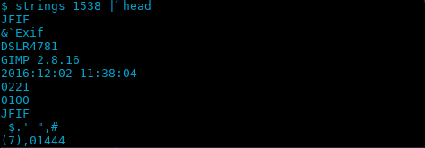

## Camera Model

### Description

Find the camera model.
Flag = SharifCTF{md5(Camera_Model)}

[challenge](Image_Viewer.tar.xz)

### Solution

The executable file on running displays an image.

[!image](image.png)

I figured that we had to find the camera model of the camera which captured this photo. The image must be somewhere within the executable itself, so I examined it with binwalk and sure enough:

```
$ binwalk Image_Viewer -e                                                                                         

DECIMAL       HEXADECIMAL     DESCRIPTION
--------------------------------------------------------------------------------
0             0x0             ELF, 64-bit LSB executable, AMD x86-64, version 1 (SYSV)
5432          0x1538          Zlib compressed data, best compression
```

Running the strings command on the image [file](./_Image_Viewer.extracted/1538) gives us the model of the camera



Calculating SharifCTF{md5('DSLR4781')}, we get the flag `SharifCTF{ccb7ed56eea6576263abeca4cdb03f62}` .	