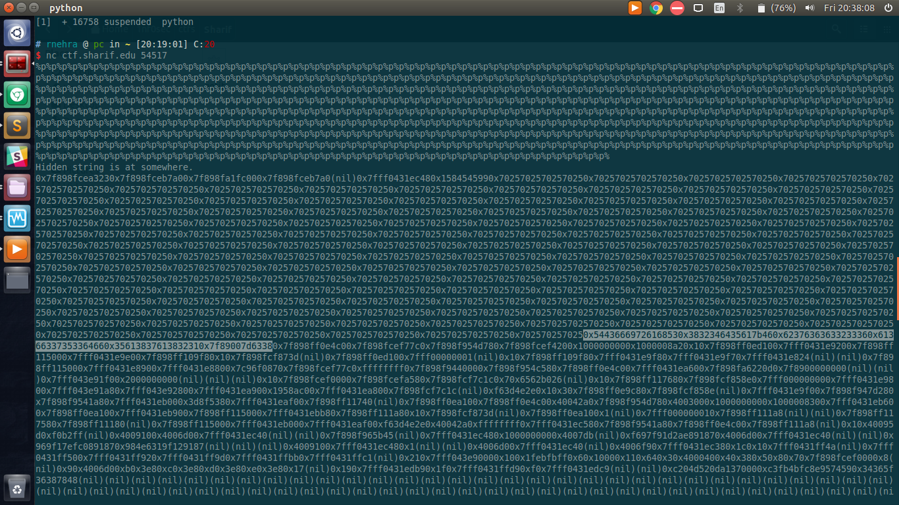

## Guess (pwn-50)

### Description
```I know guessing is a pain. Writhe in my cage of torment.```

### Solution

* A typical format-string bug
* Just put a lot of `%p`'s and search for ascii characters.
* On hex-decoding, found the flag.
* `SharifCTF{a5d428632ccc7bfd357c6a128a78a58c}`


