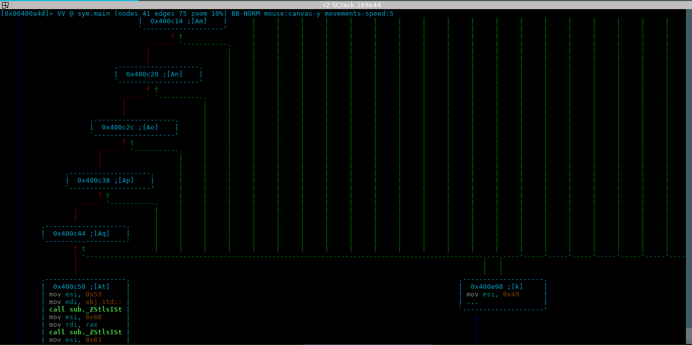
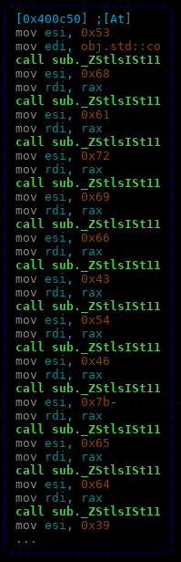

## SCrack

### Description

Run and Capture the flag!

[challenge](./SCrack.tar.xz)

### Solution

On running the binary, it asks for a `valid key`. So, I opened up gdb and ran it again, but `Dont trace me!` got echoed back. We were limited to static analysis to figure out the flag. I opened the binary in radare2 and examined the disassembly.

The cascading conditional checks (similar to the baby-re challenge of defcon-16) ended in either `0x400c50` or `0x400e98`.
Looking at 0x400c50:

Converting the hex values to ascii gives the flag: `SharifCTF{ed97d26356dadb5cde0902006c7deb}` .