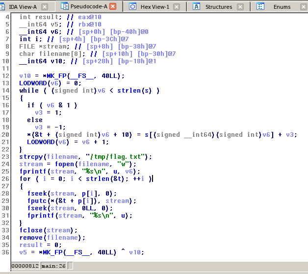
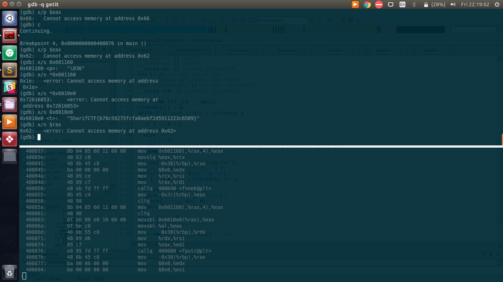

## Getit (Reverse-200)

### Description
Open and read the flag file.
[Challenge file](./getit)

### Solution
* On opening the file in IDA, I found that the program creates a file `flag.txt`. Inside the for-loop, it writes something from a variable `*(p[i]+&t)` to `flag.txt` and then again writes something from a variable `u`. So, these are our suspects. Let's move to the debugger.

 

* On analysing these variable by putting suitable breakpoints, I found the flag.
   
