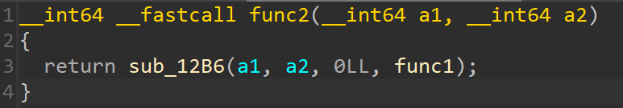

# cplusplus
created by flocto

## Challenge
> idk why everyone keeps telling me to use c++? c is just as good.  

#### Downloads
[cplusplus](./files/cplusplus) / [output.txt](./files/output.txt)


## Solution

Let's see what type of binary we are provided with.

`$ file cplusplus`  

`cplusplus: ELF 64-bit LSB pie executable, x86-64, version 1 (SYSV), dynamically linked, interpreter /lib64/ld-linux-x86-64.so.2,BuildID[sha1]=51025b1a4cb2d6cc5099db31b6ad562f023d23af, for GNU/Linux 3.2.0, stripped`


It's an ELF64 file. Using IDA Free 8.4 to decompile this, we can find the `main` function.


Here are a few things to notice rightaway.
_(I'll be referencing the line numbers using **bold** superscripts.)_

- The program creates a two buffers `ptr[2]`<sup>**8**</sup> and `s[72]`<sup>**9**</sup>
- It reads the `stdin` and stores the value in `s`<sup>**13**</sup>. This probably is the `flag` we need to find.
- It reads $2$ bytes from `/dev/urandom` and stores them in `ptr` buffer<sup>**14**</sup>. These are just two random numbers generated during runtime.
- For each character of the flag, it calls three functions `sub_1256`, `sub_133F` and `sub_1374` over some values, does some calculations and prints the result.
- We are given the file [output.txt](./files/output.txt). This is probably the output we get when we enter the flag.

##### Let's start by renaming some symbols.

- `ptr`  &rarr; `random`
- `s` &rarr; `flag`
- `sub_1256` &rarr; `func1`
- `sub_133F` &rarr; `func2`
- `sub_1374` &rarr; `func3`
- `v6` &rarr; `num`
- `v3` &rarr; `x`
- `v4` &rarr; `y`

As a result, `main` becomes:


Now, let's start analysing each `func` one by one.

#### 1. func1


This function just uses another function `sub_1209`  to loop over till `i` reaches `a2` and does the same thing with `a1`. Then returns the result mod some value.

##### Renaming:

- `a1`  &rarr; `a`
- `a2` &rarr; `b`
- `sub_1209` &rarr; `func0`

Also, we can find the value of `qword_4010` in the `.data` section. Which is `3B9ACA07h` or $10^9+7$ in base $10$. We'll call this value $p$ from now.

`func1` becomes:


Let's start analysing `func0` now.

#### 1.1 func0


Alright, so this is something interesting.

We can see that the first loop<sup>**6**</sup> is iterating `i` to find the **first unset bit** of `a1` (from the right).

This is essentially:

```python
i: int = 1      # start with i = 1
while i & a:    # while i-th bit of a is set
    i = i << 1  # left shift i by 1 place
```

For example, calling `func0` on `a1` $ = 151_{10} = 10010111_{2}$ will set `i` to $1000_{2} = 8_{10}$ initially.

Now the next loop<sup>**8**</sup> starts with setting `j` = `i | a1`. So basically `j` will have the first unset bit of `a1` being set. `i` is then right shifted by $1$, and then `j` is set to `j & ~i`. This process then repeats untill `i` becomes $0$.

Let's keep following our above example:

1. `a1` $ = 151_{10} = 10010111_{2}$
2. `i` $ = 1000_{2} = 8_{10}$
3. `j = i | a` $ = 10011111_{2} = 159_{10}$
   1. `i = i >> 1` $ = 100_{2} = 4_{10}$
        `j = j & ~i` $ = 10011111_{2}$ `&` $11111011_{2} = 10011011_{2} = 155_{10}$ 
   2. `i = i >> 1` $ = 10_{2} = 2_{10}$
        `j = j & ~i` $ = 10011011_{2}$ `&` $11111101_{2} = 10011001_{2} = 153_{10}$
   3. `i = i >> 1` $ = 1$
        `j = j & ~i` $ = 10011001_{2}$ `&` $11111110_{2} = 10011000_{2} = 152_{10}$
   4. `i = i >> 1` $ = 0$
        `break`

So `func0` for $151$ gives $152$. This seems interesting. It could be that `func0(c)` just returns the **successor** of `c`. Let's prove this by writing this in python.

```python
def func0(a: int) -> int:
    i: int = 1
    while i & a:
        i <<= 1
    
    j: int = i | a
    while True:
        i >>= 1
        if not i:
            break
        j &= ~i
    return j
```
After observing this function for a few non-negative values of `a`, it becomes clear that `c = func0(c)` resolves to `c++` as `func0(c) = c+1`. This was what the challenge description was about.

Let's get back to `func1`.

We can now rewrite `func1` as:

```c
uint64_t func1(uint64_t a, uint64_t b) {
    for (int i = 0; i < b; i++)
        a++;
    return a % p;
}
```

This resolves to `func1(a, b) = (a + b) % p`. So this function just returns the **sum** of the values passed to it $\text{mod} \ p$.

#### 2. func2



##### Renaming:

- `a1`  &rarr; `a`
- `a2` &rarr; `b`
Note that the function `func1` is being passed to the function `sub_12B6`<sup>**3**</sup> as a **function pointer**. We'll rename it to `binary_exp` (_peak foreshadowing right here_).
- `sub_12B6` &rarr; `binary_exp`


#### 2.2 binary_exp


Not much to say here, it just does repeats the function `*a4`<sup>**5**</sup> passed to it `a2` times efficiently in $\text{O}(\log n)$ time instead of $\text{O}(n)$, `a2` number of times starting with `a3` as the initial value and then returns the result. It also does everything $\text{mod} \ p$. Look up [cp-algorithms/binary-exponentiation](https://cp-algorithms.com/algebra/binary-exp.html) for more info.

Coming back to `func2`. This is just applying `func1` i.e. **sum** on `a`, `b` number of times.


This is basically _adding_ `a` _to itself_ `b` _number of times_ which resolves to `func2(a, b) =  a * b % p`. So this function just returns the **product** of the values passed to it $\text{mod} \ p$.

#### 3. func3


Following the same logic we did for `func2`, this resolves to `func3(a, b) = a ^ b % p` where `^` denotes power. So this function just **exponentiates** the value passed to it $\text{mod} \ p$.

As a result, we have resolved all three functions:

#### Resolution:

1. $\text{func1}(a, b)= a + b \ (\text{mod} \ p)$
2. $\text{func2}(a, b)= a \times b \ (\text{mod} \ p)$
3. $\text{func3}(a, b)= a^b \ (\text{mod} \ p)$

Where $p = 10^9 + 7$

As a result, the `main` function loop can be written as:

```c
...
int64_t num = 0;
for (int64_t i = 0; flag[i]; i++) {
    x = num + flag[i]
    y = x * (uint8_t) random[0];
    num = pow(y, (uint8_t) random[1]);
    if (i)
        printf(", ");
    printf("%zu", num);
}
...
```

Now the challenge lies on finding the values `random[0]` $(r_1)$ and `random[1]` $(r_2)$. Here, we will have to use some prior knowledge. We know that that flag format if of the form `amatuersctf{...}`. So, the first letter of the flag is `'a'`.

Since the `sizeof` $r_1$ and $r_2$ is $1$ byte each, they can only contain values in the range $[0,255]$. We will use this fact to brute-force a **unique** solution for $(r_1, r_2)$.

```python
p = 10**9 + 7

# [816696039, ..., 573068354]
nums = [int(num) for num in open('output.txt').read().split(', ')]

solutions = []
for r1 in range(256):
    for r2 in range(256):                    
        num = 0 # for the first iteration

        # amateursCTF{...}
        # we know that the flag starts with 'a'
        x = num + ord('a')
        y = x * r1 % p
        num = pow(y, r2, p)
        
        # compare the result with the given output value
        if num == nums[0]:
            solutions.append((r1, r2))

assert len(solutions) == 1

r1, r2 = solutions[0]

print(f'{(r1,r2) = }')

assert r1 == 237
assert r2 == 41

```

Luckily, we found a **unique** solution: $(r_1, r_2) = (237, 41)$

Now, we can calculate the flag using euler's totient function (in RSA) and modular inverses.

$$ \phi(p) = p-1 \\ r_2 d \equiv 1 \ (\text{mod} \ \phi(p)) \\ \implies d \equiv r^{-1}_2 \ (\text{mod} \ p-1) \\ \therefore y \equiv c^d \ (\text{mod} \ p)$$

$$ y \equiv xr_1 \ (\text{mod} \ p) \\ \implies x \equiv yr^{-1}_1 \ (\text{mod} \ p) $$

## Full Solve Script
```python
p = 10**9 + 7

# [816696039, ..., 573068354]
nums = [int(num) for num in open('output.txt').read().split(', ')]

solutions = []
for r1 in range(256):
    for r2 in range(256):                    
        num = 0 # for the first iteration

        # amateursCTF{...}
        # we know that the flag starts with 'a'
        x = num + ord('a')
        y = x * r1 % p
        num = pow(y, r2, p)
        
        # compare the result with the given output value
        if num == nums[0]:
            solutions.append((r1, r2))

assert len(solutions) == 1

r1, r2 = solutions[0]

assert r1 == 237
assert r2 == 41

num = 0
flag = ''
for c in nums:
    # totient
    phi = p - 1
    
    # RSA
    d = pow(r2, -1, phi)
    y = pow(c, d, p)
    
    # x * r1 = 1 (mod p)
    x = pow(r1, -1, p) * y % p
    # remember to subtract num
    x = x - num
    
    flag += chr(x)
    num = c
    
print(flag, end='')
# amateursCTF{r/programminghorror/comments/18x7vk9/}
```