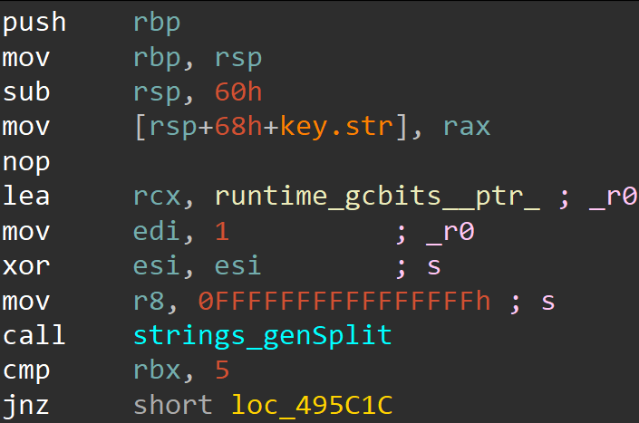
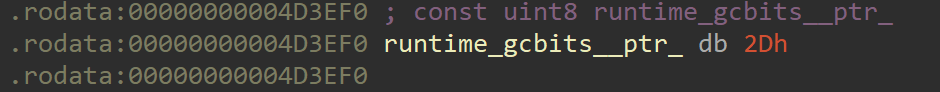
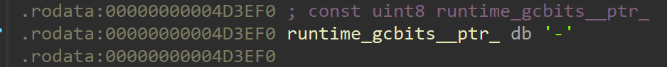
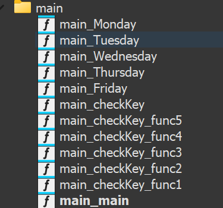
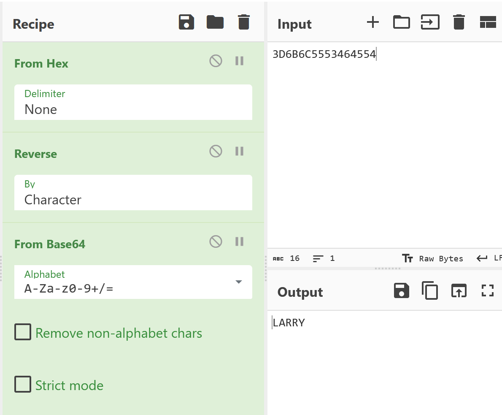
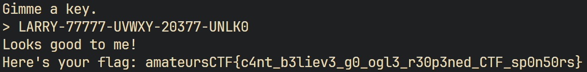

# gogogaga
created by flocto

## Challenge
> "wow its my favorite language to rev" - nobody  
`nc chal.amt.rs 2200`

#### Downloads
[main](./files/main)


## Solution

Let's see what type of binary we are provided with.

`$ file main`  

`main: ELF 64-bit LSB executable, x86-64, version 1 (SYSV), statically linked, Go BuildID=qXgpNaa6CA-hMFGspCIU/iDmVzP5EhqshPquYFC-C/xlqOk9gfHBc2_a52vYID/fjCleY4wHB8pzpHw6Yk5, with debug_info, not stripped`


It's an ELF64 golang binary. Using IDA Free 8.4 to decompile this, we can find the `main_main` function.

```go
// main.main
void __fastcall main_main()
{
  retval_487120 File; // [rsp-28h] [rbp-A8h] BYREF
  _QWORD v1[2]; // [rsp+28h] [rbp-58h] BYREF
  _QWORD v2[2]; // [rsp+38h] [rbp-48h] BYREF
  _QWORD v3[2]; // [rsp+48h] [rbp-38h] BYREF
  _QWORD v4[2]; // [rsp+58h] [rbp-28h] BYREF
  _QWORD v5[3]; // [rsp+68h] [rbp-18h] BYREF
  io_Writer v6; // 0:rax.8,8:rbx.8
  io_Writer v7; // 0:rax.8,8:rbx.8
  io_Reader v8; // 0:rax.8,8:rbx.8
  io_Writer v9; // 0:rax.8,8:rbx.8
  io_Writer v10; // 0:rax.8,8:rbx.8
  string v11; // 0:rax.8,8:rbx.8
  io_Writer v12; // 0:rax.8,8:rbx.8
  _slice_interface_ v13; // 0:rcx.8,8:rdi.16
  _slice_interface_ v14; // 0:rcx.8,8:rdi.16
  _slice_interface_ v15; // 0:rcx.8,8:rdi.16

  v5[0] = &RTYPE_string_0;
  v5[1] = &off_4D4BF8;
  v6.data = os_Stdout;
  v6.tab = (runtime_itab *)&go_itab__ptr_os_File_comma_io_Writer;
  v13.array = (interface_ *)v5;
  v13.len = 1LL;
  v13.cap = 1LL;
  fmt_Fprintln(v6, v13);
  v4[0] = &RTYPE_string_0;
  v4[1] = &off_4D4C08;
  v7.data = os_Stdout;
  v7.tab = (runtime_itab *)&go_itab__ptr_os_File_comma_io_Writer;
  v13.array = (interface_ *)v4;
  v13.len = 1LL;
  v13.cap = 1LL;
  fmt_Fprint(v7, v13);
  File._r0_2.cap = (int)runtime_newobject((internal_abi_Type *)&RTYPE_string_0);
  *(_QWORD *)File._r0_2.cap = 0LL;
  v3[0] = &RTYPE__ptr_string;
  v3[1] = File._r0_2.cap;
  v8.data = os_Stdin;
  v13.array = (interface_ *)v3;
  v13.len = 1LL;
  v13.cap = 1LL;
  v8.tab = (runtime_itab *)&go_itab__ptr_os_File_comma_io_Reader;
  fmt_Fscanln(v8, v13);
  if ( main_checkKey(*(string *)File._r0_2.cap) )
  {
    v2[0] = &RTYPE_string_0;
    v2[1] = &off_4D4C18;
    v9.data = os_Stdout;
    v9.tab = (runtime_itab *)&go_itab__ptr_os_File_comma_io_Writer;
    v14.array = (interface_ *)v2;
    v14.len = 1LL;
    v14.cap = 1LL;
    fmt_Fprintln(v9, v14);
    v1[0] = &RTYPE_string_0;
    v1[1] = &off_4D4C28;
    v10.data = os_Stdout;
    v10.tab = (runtime_itab *)&go_itab__ptr_os_File_comma_io_Writer;
    v14.array = (interface_ *)v1;
    v14.len = 1LL;
    v14.cap = 1LL;
    fmt_Fprint(v10, v14);
    v11.str = (uint8 *)"flag.txt";
    v11.len = 8LL;
    File = os_ReadFile(v11);
    File._r1_2.tab = (runtime_itab *)&RTYPE_string_0;
    File._r1_2.data = &off_4D4C38;
    v11.len = (int)os_Stdout;
    v11.str = (uint8 *)&go_itab__ptr_os_File_comma_io_Writer;
    v14.array = (interface_ *)&File._r1_2;
    v14.len = 1LL;
    v14.cap = 1LL;
    fmt_Fprintln((io_Writer)v11, v14);
  }
  else
  {
    File._r1.tab = (runtime_itab *)&RTYPE_string_0;
    File._r1.data = &off_4D4C48;
    v12.data = os_Stdout;
    v12.tab = (runtime_itab *)&go_itab__ptr_os_File_comma_io_Writer;
    v15.array = (interface_ *)&File._r1;
    v15.len = 1LL;
    v15.cap = 1LL;
    fmt_Fprintln(v12, v15);
  }
}
```

Let's ignore the redundant stuff and focus on the main part. First, we need to resolve all the strings (`&off_hex`) using the `.rodata` section to get the correct value for `fmt_Fprint`.

Highlighting only the important stuff:

```go
// main.main
void __fastcall main_main()
{
  ...
  fmt_Fprintln(v6, v13); // Gimme a key
  ...
  fmt_Fprint(v7, v13); // >
  ...
  // get the input
  fmt_Fscanln(v8, v13);
  // check the input using `main_checkKey` function
  if ( main_checkKey(*(string *)File._r0_2.cap) )
  {
    ...
    fmt_Fprintln(v9, v14); // Looks good to me!
    ...
    fmt_Fprint(v10, v14); // Here's your flag: 
     // read flag.txt
    v11.str = (uint8 *)"flag.txt";
    File = os_ReadFile(v11);
    ...
    // print the contents
    fmt_Fprintln((io_Writer)v11, v14);
  }
  else
  {
    ...
    fmt_Fprintln(v12, v15); // Try again!
  }
}
```

It's clear that we just need the `main_checkKey` function to return true for a certain key that we need to find.

#### main_checkKey

After removing redundant stuff:

```go
// main.checkKey
// local variable allocation has failed, the output may be wrong!
__int64 __golang main_checkKey(string key, __int64 a2, __int64 a3, __int64 a4, __int64 a5, string a6, int a7)
{
  ...
  strings_genSplit((int)key.str, *(_slice_string *)&key.len, v44, a6, a7);
  if ( key.len != 5 )
    return 0LL;
  ...
  if ( v10 >= 5 )
  {
    ...
    v15->fn = (uintptr)main_checkKey_func1;
    ...
    v19->fn = (uintptr)main_checkKey_func2;
    ...
    v23->fn = (uintptr)main_checkKey_func3;
    ...
    v27->fn = (uintptr)main_checkKey_func4;
    ...
    v31->fn = (uintptr)main_checkKey_func5;
    ...
  }
  else
  ...
}
```

So, this calls a `strings_genSplit` function and then calls `main_checkKey_funcN` for `N=1..5`. Here, we can kind of guess that **the key might have 5 parts** and each of these functions will check each part of the key.

Starting with this lead, lets try to find what delimeter the function uses to split the key into 5 parts. Finding this took a decent amount of time. For this, let's analyse the dissassembly of this part in IDA Graph View.



Here, everything seems fine except the `runtime_gcbits__ptr_` thing. Double click it to trace its origin.

We find this in the `.rodata` section:



converting `2Dh` to $\text{ASCII}$, we get:


Therefore, we can conclude that the delimeter is `-`. Which gives us another lead that the key could be of the form:

$\text{part}1-\text{part}2-\text{part}3-\text{part}4-\text{part}5$

And each of the `checkKey_func`s checks each part of the key individually.

#### main_checkKey_func1

Highlighting the important parts:

```go
// main.checkKey.func1
void __golang main_checkKey_func1(...)
{
  ...
  main_Monday(*(chan_bool *)(v10 + 8), *(string *)(v10 + 16));
}
```

Also, in the decompilation, we can notice some functions:


We can guess that each of these `main_checkKey_func`s calls the respective `main_*day` functions interanally. This is confirmed by seeing the decompilation of these functions. So from now, we'll only worry about these `main_*day` functions.

##### main_Monday

```go
// main.Monday
// local variable allocation has failed, the output may be wrong!
void __golang main_Monday(uint8 *check, string key)
{
  ...
  v4 = encoding_base64__ptr_Encoding_EncodeToString(encoding_base64_StdEncoding, *(_slice_uint8 *)&v9.len);
  v5 = v4.len == 8 && *(_QWORD *)v4.str == 0x3D6B6C5553464554LL;
  ...
}
```

The thing to notice here is the call to the function having `base64` in its name and the hex value `0x3D6B6C5553464554LL`.
We can guess that this probably means that the length.

Now, we can use CyberChef we can see that:


This gives us the string `LARRY`. And hence, we find $\text{part}1$ of the key: $\text{LARRY}$.

#### main_checkKey_func2 / main_Tuesday

```go
// main.Tuesday
void __golang main_Tuesday(string key, runtime_hchan *check)
{
  ...
  v2 = 0LL;
  v3 = 0LL;
  while ( v2 < 5 )
  {
    if ( key.len <= (unsigned __int64)v2 )
      runtime_panicIndex();
    v5 = key.str[v2];
    elem[0] = v5 < 0x30u;
    if ( v5 >= 0x30u )
      elem[0] = key.str[v2] > 0x39u;
    ...
    v4 = (unsigned __int8)(key.str[v2++] - 48);
    v3 += v4;
  }
  elem[0] = v3 == 35;
  runtime_chansend1(check, elem);
}
```

Decoding `0x30u` and `0x39u` to $\text{ASCII}$, we get: `'0'` and `'9'` respectively. Therefore, we can guess that each letter of $\text{part}2$ of the key should be a digit. The lines `v4 = key.str[v2++] - 48` and `v3 += v4` and later `elem[0] = v3 == 35;` and `runtime_chansend1(check, elem);` imply that it is adding all the digits and checking the sum of the digits. Also, the lines:
```go
...
  while ( v2 < 5 )
  {
    if ( key.len <= (unsigned __int64)v2 )
      runtime_panicIndex();
  ...
  }
...
```
Imply that the length of $\text{part}2$ should be $5$.

Therefore, we can choose $\text{part}2 = 77777$ which satisfies all the conditions in `main_Tuesday`.

#### main_checkKey_func3 / main_Wednesday

```go
// main.Wednesday
void __golang main_Wednesday(uint8 *check, string key, runtime_hmap *a3)
{
  ...
  while ( v6 < 5 )
  {
    if ( (unsigned __int64)str <= v6 )
      runtime_panicIndex();
    v8 = v5[v6];
    if ( v8 < 0x41u
      || v8 > 0x5Au
      || (*(_QWORD *)&t[1] = v6,
          t[0] = v8,
          runtime_mapaccess1(&RTYPE_map_uint8_bool_0, &_r0, (internal_abi_MapType *)t, a3),
          *v9) )
    {
      runtime_chansend1(c, &runtime_egcbss);
      return;
    }
    t[0] = check[*(_QWORD *)&t[1]];
    runtime_mapassign(&RTYPE_map_uint8_bool_0, &_r0, (internal_abi_MapType *)t, (runtime_hmap *)t[0]);
    ...
  }
  ...
  for ( i = 0LL; i < 5; ++i )
  {
    if ( v20.len <= (unsigned __int64)i )
      runtime_panicIndex();
    v20.array[i] ^= 0x60;
  }
  v18 = runtime_slicebytetostring((runtime_tmpBuf *)&t[41], v20.array, v20.len);
  main_Tuesday(v18, c);
}
```
This function might seem intimidating at first, but it's not very difficult to see that:
1. The length of $\text{part}3$ should be $5$. Because:
```go
...
while ( v6 < 5 )
  {
    if ( (unsigned __int64)str <= v6 )
      runtime_panicIndex();
  ...
  }
...
```
2. `0x41u` = `'A'` and `0x5Au` = `'Z'`. So, each letter of $\text{part}3$ should be an **UPPERCASE** english alphabet. 
3. Each letter is stored in a hashmap which and checks are performed so that the repetition of letters is not allowed.
4. Each letter is then $\text{xor}$'d with `0x96`. And then `main_Tuesday` is called on the result.

So, $\text{part}3$ is just $5$ distinct alphabets which when $\text{xor}$'d with `0x96` and then called `main_Tuesday` upon return true.

We can solve this by $\text{xor}$-ing a valid solution to `main_Tuesday` with `0x96` and hope we get the result in the valid range `'A'` to `'Z'`.

Since we cannot repeat the letters (digits), we'll use the solution:

$56789 \ (5+6+7+8+9 = 35)$

**But**! We need to convert these to their respective $\text{ASCII}$ values.

$[53, 54, 55, 56, 57]$

$\text{xor}$-ing this with `0x96`, we get:

$[85, 86, 87, 88, 89]$

Converting these values back to $\text{ASCII}$, we get:

$\text{UVWXY}$

Therefore, $\text{part}3$ of the key is $\text{UVWXY}$.


#### main_checkKey_func4 / main_Thursday

```go
// main.Thursday
void __golang main_Thursday(uint8 *check, string key)
{
  ...
  v3 = 0LL;
  v4 = 0LL;
  v5 = 0LL;
  while ( v3 < 5 )
  {
    if ( v13.len <= (unsigned __int64)v3 )
      runtime_panicIndex();
    for ( i = v13.array[v3]; (_BYTE)i; i = v9 )
    {
      v7 = v4-- + 1;
      v8 = v5-- + 1;
      v9 = i;
      if ( (i & 1) != 0 )
        v4 = v7;
      if ( (i & 2) != 0 )
        v5 = v8;
      LOBYTE(v9) = (unsigned __int8)i >> 2;
    }
    ++v3;
  }
  elem[0] = v4 == 5;
  if ( v4 == 5 )
    elem[0] = v5 == 3;
  runtime_chansend1(c, elem);
}
```

This by itself involes some involved bitwise calculations.

Again, the length of this part should also be $5$ using the same logic we used in the above functions.

Now, this loops for each $\text{byte}$ of the part of the key and does the following logic:

```python
s5 = 0
s3 = 0

# replace this key with the solution we find 
key = 'PLACEHOLDER'

# for each byte in the part
for b in key:
    while b:
        # set these temporary values
        x = s5 + 1
        y = s3 + 1
        
        s5 -= 1
        s3 -= 1
        
        # if the first bit (from right) of `b` is set
        if b & 1:
            # set s5 to x
            s5 = x
        # if the second bit (from right) of `b` is set
        if b & 2:
            # set s3 to y
            s3 = y

        # bit shift `b` by 2
        # this basically means dividing `b` is segments of 4
        b >>= 2

# in the end,
assert s5 == 3 # s5 should be 5
assert s3 == 3 # s3 should be 3
```

We can solve this using pen and paper and arrive to the solution:


$$\begin{align*}
    b_1 &= 00\,11\,00\,10 = \ '2' \\
    b_2 &= 00\,11\,00\,00 = \ '0' \\
    b_3 &= 00\,11\,00\,11 = \ '3' \\
    b_4 &= 00\,11\,01\,11 = \ '7' \\
    b_5 &= 00\,11\,01\,11 = \ '7'
\end{align*}$$


where $\text{part}4 = b_1b_2b_3b_4b_5 = 20377$

#### main_checkKey_func5 / main_Friday

```go
// main.Friday
void __golang main_Friday(chan_bool check, string key)
{
  
  ...
  qmemcpy(v20, "UNL0CK", sizeof(v20));
  ...
  v4 = 0LL;
  ...
  for ( k = 1LL; k < 6; ++k )
  {
    for ( m = 1LL; (__int64)m < 7; ++m )
    {
      if ( key.str <= (uint8 *)(k - 1) )
        runtime_panicIndex();
      v12 = m - 1;
      if ( v20[m - 1] == *((_BYTE *)v2 + k - 1) )
      {
        if ( *(&v21 + 3 * k) <= v12 )
          runtime_panicIndex();
        if ( m >= v24[3 * k] )
          runtime_panicIndex();
        *(_QWORD *)(v24[3 * k - 1] + 8 * m) = *(_QWORD *)(*(_QWORD *)&v18[24 * k + 24] + 8 * m - 8);
      }
      else
      {
        v13 = *(_QWORD *)&v18[24 * k + 24];
        if ( m >= *(&v21 + 3 * k) )
          runtime_panicIndex();
        v14 = v24[3 * k];
        v15 = *(_QWORD *)(v13 + 8 * m);
        v16 = v24[3 * k - 1];
        if ( v14 <= v12 )
          runtime_panicIndex();
        v17 = *(_QWORD *)(v13 + 8 * m - 8);
        if ( *(_QWORD *)(v16 + 8 * m - 8) < v15 )
          v15 = *(_QWORD *)(v16 + 8 * m - 8);
        if ( v17 < v15 )
          v15 = v17;
        if ( m >= v14 )
          runtime_panicIndex();
        *(_QWORD *)(v16 + 8 * m) = v15 + 1;
      }
    }
  }
  if ( v24[15] <= 6uLL )
    runtime_panicIndex();
  elem = *(_QWORD *)(v24[14] + 48) == 3LL;
  runtime_chansend1(v3, &elem);
}
```

This is by far the most complicated function. But, we only need to notice the line `if ( v20[m - 1] == *((_BYTE *)v2 + k - 1) )`. Here, `v20` holds the value `UNL0CK` and `v2` holds the part.

If the value at some index of the part matches with any letter of `UNL0CK`, this function does some calculations and sets `v24`.

Our goal is to **use a value of** $\text{part}5$ such that `v24[14]+48 == 3`.


```
for every letter c in `UNL0CK`
  for every letter a in part:
    do some operations
    ...
```

Since the comparisions are being done with the string `UNL0CK`, we can just iterate over all $5$-letter permutations of the string `UNL0CK` and see if the key is accepted.

##### Permute

```python
import subprocess
from multiprocessing.pool import ThreadPool
from itertools import permutations

partial_key = 'LARRY-77777-UVWXY-20377-'

perms = permutations('UNL0CK', 5)

for perm in perms:
    key = partial_key + ''.join(perm)
    
    p = subprocess.Popen('./main', stdin=subprocess.PIPE, stdout=subprocess.PIPE)
    stdout = p.communicate(key.encode())[0].decode()
    
    if 'flag' in stdout:
        print(key)
# LARRY-77777-UVWXY-20377-UNLK0
```

And so, we found the key:

$\text{LARRY}-77777-\text{UVWXY}-\text{20377}-\text{UNLK}0$

Using this as the key, we get the flag:



`amateursCTF{c4nt_b3liev3_g0_ogl3_r30p3ned_CTF_sp0n50rs}`