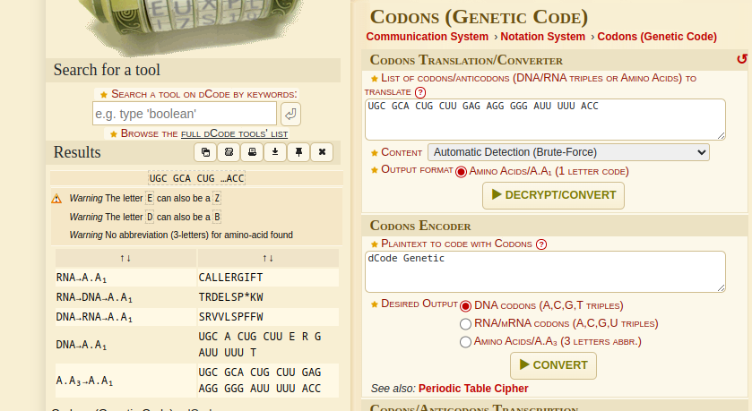

# CODEON

## Author :  Sankalp Chakre

### DESCRIPTION :
* My biochemist friend has doubt that his phone is used by others for calling without knowing him. So, he wants me to find some information related to it, that’s why he sent me some information related to it, also he uses one word short-forms mostly. But I am unable to understand sent data, can you help me?

### Files :
* [CODEON.txt](CODEON.txt)

#### Analysis : 
* On reading codeon.txt we get that first we have to find how the matrix R is being calculated from P and Q which is a bit guessy here
* I tried many things here like addition,subtration,dot product,multiplication, But particularly on element-wise-multiplication and since the name of Dmitri Mendeleev was given i thought of the periodic table and after element wise multiplication and then taking mod 118 of each element we get the result matrix 
* so using this script 
```python
import numpy as np

matrix_a = np.array([
    [45, 35, 93, 95, 24, 65],
    [25, 15, 55, 64, 36, 45],
    [15, 65, 62, 16, 65, 38],
    [19, 64, 35, 69, 65, 63],
    [47, 67, 48, 60, 39, 27],
    [66, 48, 77, 22, 10, 69]
])

matrix_b = np.array([
    [33, 25, 30, 11, 68, 65],
    [83, 36, 19, 33, 55, 51],
    [20, 16, 48, 63, 41, 71],
    [30, 42, 12, 25, 31, 37],
    [51, 3, 44, 23, 43, 85],  
    [20, 39, 28, 41, 1, 70]   
])

matrix_elementwise_product = matrix_a * matrix_b
matrix_result_mod = np.mod(matrix_result, 118)
print(matrix_result_mod)
```
* I get 
[69,49,76,101,98,95]
[69,68,101,106,92,53]
[64,96,26,64,69.102]
[98,92,66,73,9,89]
[37,83,106,82,25,53]
[22,102,32,76,10,110]
as the result matrix 

* Now converting the numbers in the matrix to there corresponding elements according to the periodic table 

* [Tm  In  Os  Md  Cf  Am]
[Tm  Er  Md  Sg  U  I]
[Gd  Cm  Fe  Gd  Tm  No]
  [Cf  U  Dy  Ta  F  Ac]
 [Rb  Bi  Sg  Pb  Mn  I]
  [Ti  No  Ge  Os  Ne  Ds] 

* And as we can see that the last column comes out to be amino acids.
* On searching the name of Felix Delastelle on google we get that it redirects us to BIFID Cipher so i guessed that aminoacids is the key for decrypting the DATA that is given to us.
* So i go to CyberChef
 

* And the output was "UGC GCA CUG CUU GAG AGG GGG AUU UUU ACC"
* Now i again got confused about what to do.
* Then i searched the name of challenge Codeon with the term biochemistry and then i got that the result string is CODON which we have to decode to get the final flag
* So i go to dcode.fr 

 

 * And here i got CALLERGIFT as the string 

 * So our flag is VishwaCTF{CALLERGIFT}
