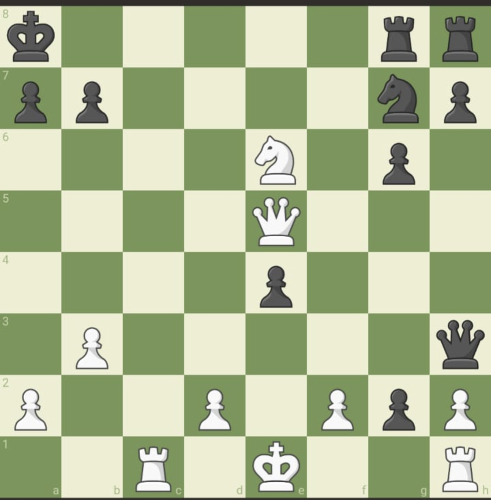

# LET's SMOTHER THE KING

## Author : Naman Chordia


### DESCRIPTION :
* In my friend circle, Mr. Olmstead and Mr. Ben always communicate with each other through a secret code language that they created, which we never understand. Here is one of the messages Mr. Ben sent to Mr. Olmstead, which I somehow managed to hack and extract it from Ben's PC. However, it's encrypted, and I don't comprehend their programming language. Besides being proficient programmers, they are also professional chess players. It appears that this is a forced mate in a 4-move chess puzzle, but the information needs to be decrypted to solve it. Help me out here to solve the chess puzzle and get the flag.

* Flag format: VishwaCTF{move1ofWhite_move1ofBlack_move2ofWhite_move2ofBlack_move3ofWhite_move3ofBlack_move4ofWhite}.

* Note: Please use proper chess notations while writing any move.
### Files :
* [code.txt](code.txt)


#### Analysis : 
* On searching the names of the persons given in description i.e. Ben Olmstead we get that they have a return a coding language called malbolge 
* So I searched for malbolge interpreter online and after running what was given in code.txt there we got
```
White- Ke1,Qe5,Rc1,Rh1,Ne6,a2,b3,d2,f2,h2 Black- Ka8,Qh3,Rg8,Rh8,Bg7,a7,b7,e4,g2,g6,h7
```

* So this is the board setup



* And taking the hint form the name of chall that this should be a smother's mate in 4 moves I got the moves
```
Nc7+
Kb8
Na6+
Ka8
Qb8+
Rxa8
Nc7#
```

So the flag is 
`VishwaCTF{Nc7+_Kb8_Na6+_Ka8_Qb8+_Rxb8_Nc7#}`