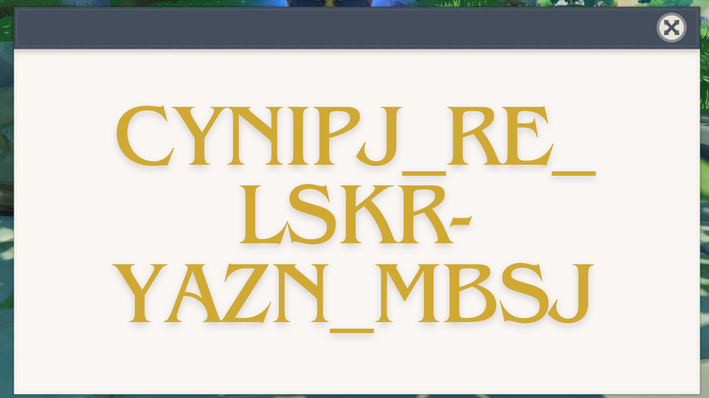
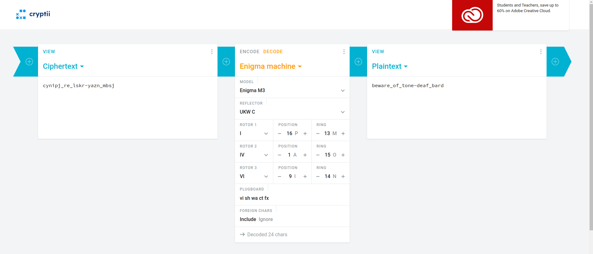

# TEYVAT TALES

## DESCRIPTION
All tavern owners in Mondstadt are really worried because of the frequent thefts in the Dawn Winery cellars. The Adventurers’ Guild has decided to secure the cellar door passwords using a special cipher device. But the cipher device itself requires various specifications….which the guild decided to find out by touring the entire Teyvat.

PS: The Guild started from the sands of Deshret then travelled through the forests of Sumeru and finally to the cherry blossoms of Inazuma

## Author: Amruta Patil

### FILES :
 [index.html](index.html) 
 [script.js](script.js) 
 [styles.css](styles.css)

 ### Analysis:
 * On analysing the files given there was a image folder containing various images which we have to decode and they seem to be like some ancient language maybe genshin or something
 * But on reading  [script.js](script.js) we can see that all the answers were given in the js script only which were 
 * enigma m3
 * ukw c
 * rotor1 i p m rotor2 iv a o rotor3 vi i n
 * vi sh wa ct fx

 * on putting these answers on the webpage we got this
 
 
 * So i thought of decoding the text given here by enigma so i go to the website https://cryptii.com/pipes/enigma-machine and put all the conditions of enigma 

 

 And BOOM! we got this 

 So this is our flag
 `VishwaCTF{beware_of_tone-deaf_bard}`