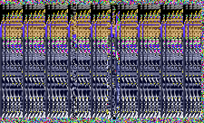
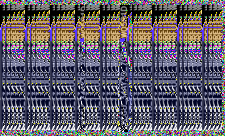
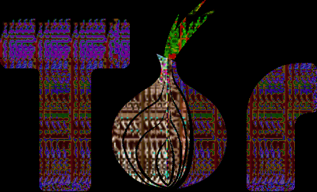
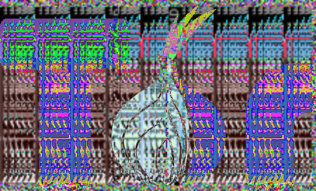
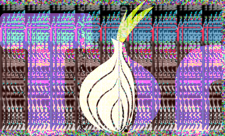
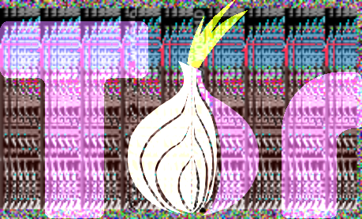
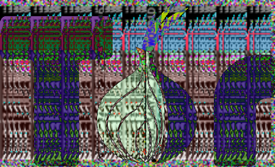

## Into The Dark 

* We were given with two files [heirlooms.txt](assets/heirlooms.txt) and [World.png](assets/World.png). 

* There is a `base64` encoded string at end of [heirlooms.txt](assets/heirlooms.txt) which after decoding turns out to be : 

```txt
Below is the vigenere chiper and its key is first three letters of whatever you find for dealing with aliens ...

bax[0q005:0l082, 0o078:0q07Q, :] = zfu[0o005:0q082, 0l050:0o054, :]
Tdgem kawj uswhfv wsrewez kzmv kas rewvgg .
```

* Now decoding the above part from `vigenere cipher` returns `TOR` as the key (hinted as Onion and three letter)

```txt
img[0x005:0x082, 0x078:0x07C, :] = img[0x005:0x082, 0x050:0x054, :]
Apply this before dealing with the aliens .
```

* Then using the followwing hex numbers as indices
```
0x05D
0x2AF
0x45D
0x5D3
0x2AF
0x5F7
0x2AF
0x740
0x866
0x8A8
0x866
0xA81
0xBB7
0xEC2
0x116C
0xBB7
0xA81
0x1700
0x1E3A
0x5F7
```

* I indexed into the raw bytes of `World.png` and got this string : `torlogowikisaveaspng` 

* From the decoded text it seems that we had to apply some operation to the image and using the above decoded string and getting a hint from this value `*0x7DB` which equals `2011` in decimal, everything matched with this image `https://en.wikipedia.org/wiki/File:Tor-logo-2011-flat.svg`. 

* By checking the aspect ratio of this image and `World.png` the most logical guess was to perform some bitwise operation between those two images. 

* Initially the `World.png` looked like :



* After performing this operation   
`img[0x005:0x082, 0x078:0x07C, :] = img[0x005:0x082, 0x050:0x054, :]`   

It turned into : 



* This cleared up the flag hidden in the image, but we needed more clarity to read it. 

* Then the only possible step was to perform bitwise operation between this image and `Tor-logo-2011-flat.svg.png` 

Image Processing
---


Using the following script I performed all possible operations between two images : 

```python
import numpy as np
import cv2
import matplotlib.pyplot as plt

img = np.array(Image.open('World.png'))
img[0x005:0x082, 0x078:0x07C, :] = img[0x005:0x082, 0x050:0x054, :]
img = cv2.resize(img, (459, 278))

img2 = cv2.imread('Tor-logo-2011-flat.svg.png')

img2 = img2[:, :, :3] # 4 channels -> 3 channels 


final = cv2.bitwise_xor(img, img2)
cv2.imwrite('final_xor.png', final)

final = cv2.bitwise_and(img, img2)
cv2.imwrite('final_and.png', final)

final = cv2.bitwise_or(img, img2)
cv2.imwrite('final_or.png', final)


final = cv2.absdiff(img, img2)
cv2.imwrite('final_diff.png', final)

final = cv2.add(img, img2)
cv2.imwrite('final_add.png', final)

# plt.imshow(final)
```
---

### Here are all images 

`AND`   



`XOR`   



`OR`   



`ADD`   



`DIFF`    
   


Using our hawk-eyed vision and multiple failed attemps we were able to decode the flag as : `YCGU_34AY3D_70TH3_W05RlD`

### Flag
---

So finally the complete flag is : `VishwaCTF{YCGU_34AY3D_70TH3_W05RlD}` 

Overall super guessy, random challenge and ended up getting a first blood 🩸 


