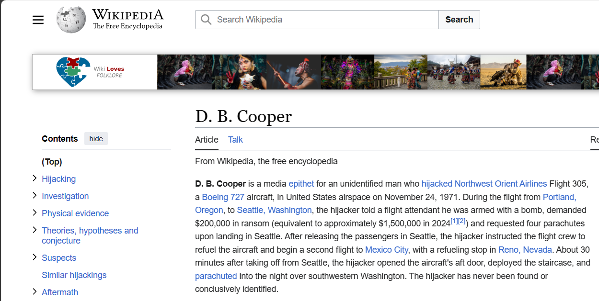

## STEGO/MYSTERIOUS OLD CASE WRITEUP -->

We were given an audio file (.mp3) which on initial hearing doesn’t yield much but on playing the audio in the reverse order we are able to make out the following information

Name - Dan Cooper
Date - 24 Nov 1971
Left Seattle, headed towards Reno
My demands were fulfilled
I did changes in flight log, uploaded to a remote server file is encrypted
Hint for description is airline  in which I am flying
Most important : The secret key is split and hidden in every element of Fibonacci series starting from 2

On little bit of research we come across the case of Dan Cooper and his hijack of the flight no. 305 of North-West Orient airlines.

On inspecting the metadata of the audio we are given a drive folder link that contains our flight logs 

[`https://drive.google.com/file/d/1bkuZRLKOGWB7tLNBseWL34BoyI379QbF/view?usp=drive_lin`](https://drive.google.com/file/d/1bkuZRLKOGWB7tLNBseWL34BoyI379QbF/view?usp=drive_lin)

And the password for this drive as hinted in description becomes `northwestorientairlines` .

But on opening we get a swarm of 7GB files but by the case of Dan Cooper we just had to focus on file no. `305` on opening that we could see flag characters but scattered and the logic of scattering was that the characters were at the indices corresponding to fibonacci series starting from 2 so on extracting those characters we get the flag as.

`VishwaCTF{1_W!LL_3E_B@CK}`