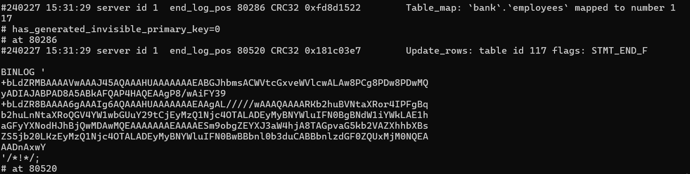

# Forensics/Smoke Out The Rat Writeup -->

We were given a MySQL replication log and had to find some stuff. The traitor name was immediately found using the phone no. given in the description from the database

Database Administrator
Matthew
Miller
matthew.miller@example.com
789-012-3456

Now we had to find the outsider and on a careful inspection of the database we get an entry 

John
Darwin!
johndoe@example.com
+1234567890
123 Main St
Anytown
Anystate

Which appears quite suspicious because of the `!` and also the non-correspondence between the name name and mail as Darwin and Doe whereas in all other entries they are same and also as this was the last entry to employees table making this suspicious as if this name was made up. Then on using the tool `mysqlbinlog` we went on finding the timestamp and there we could find the change being made to our employees table 

So we could frame our flag and got the answer as 

`VishwaCTF{Matthew_Darwin_15:31:29}`