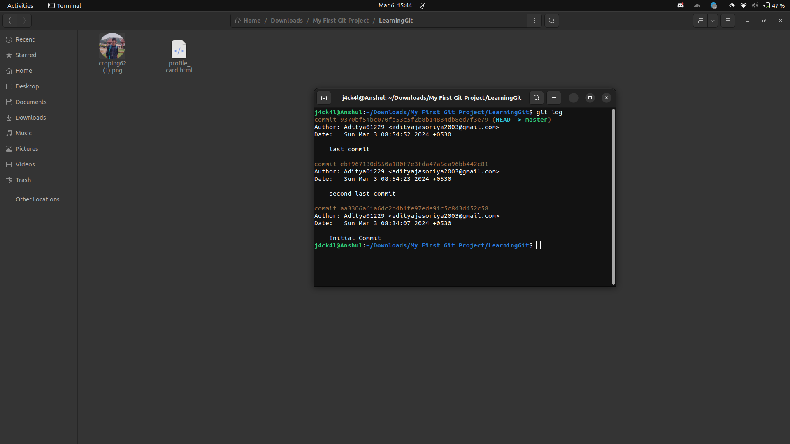
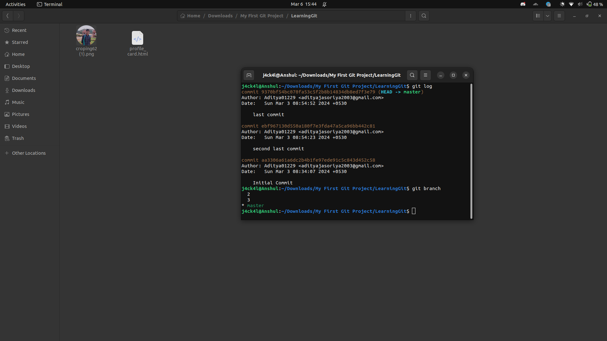
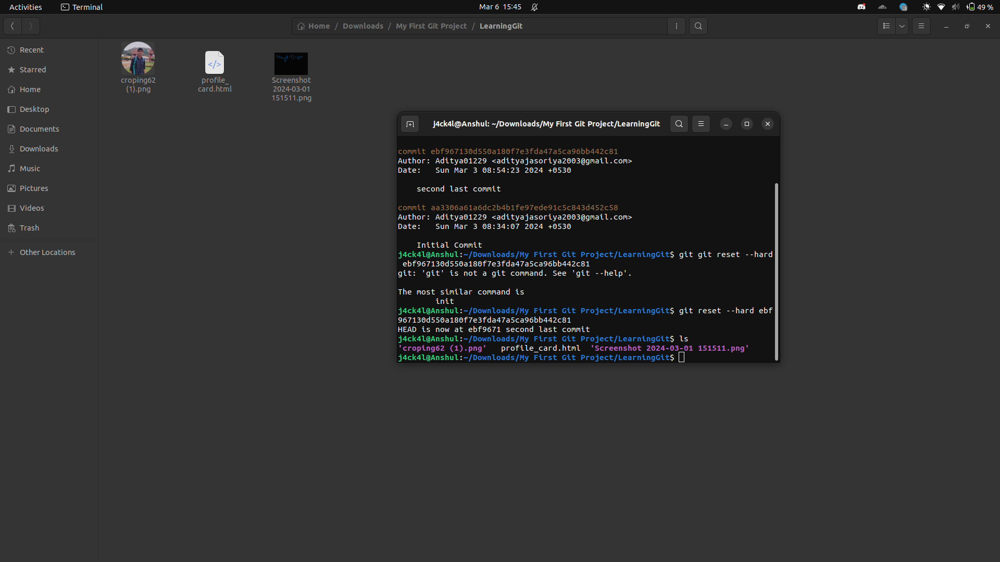
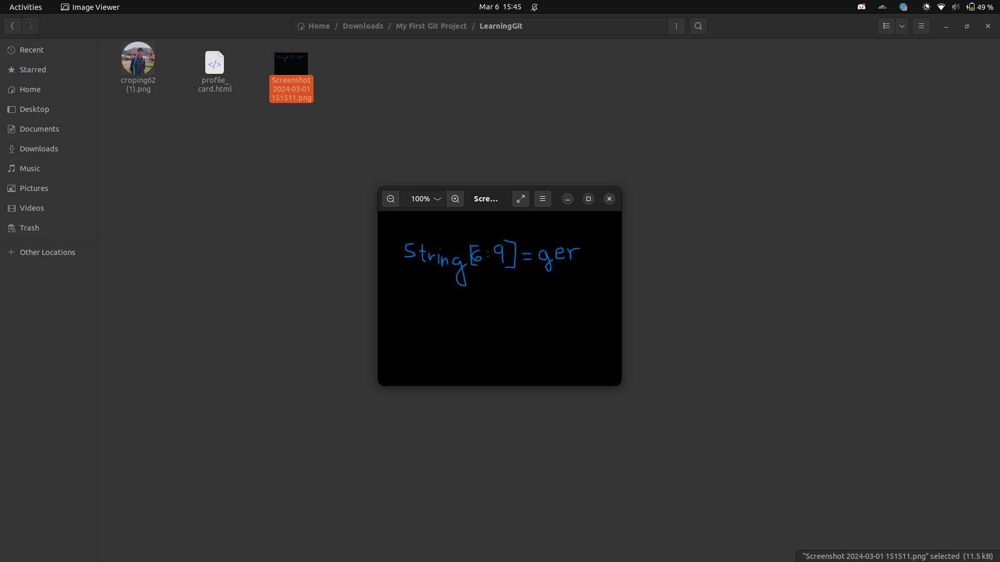
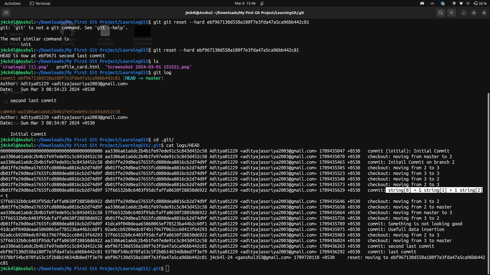
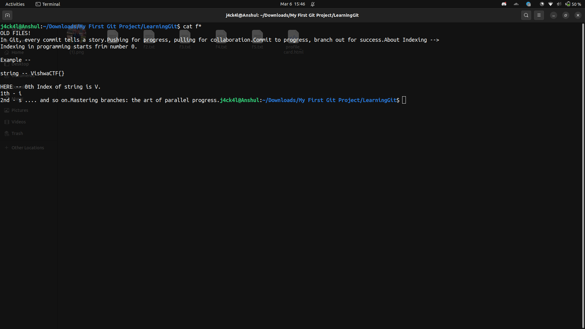
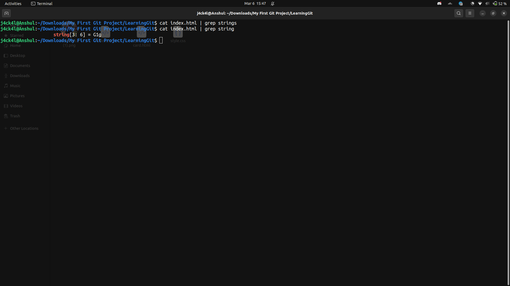
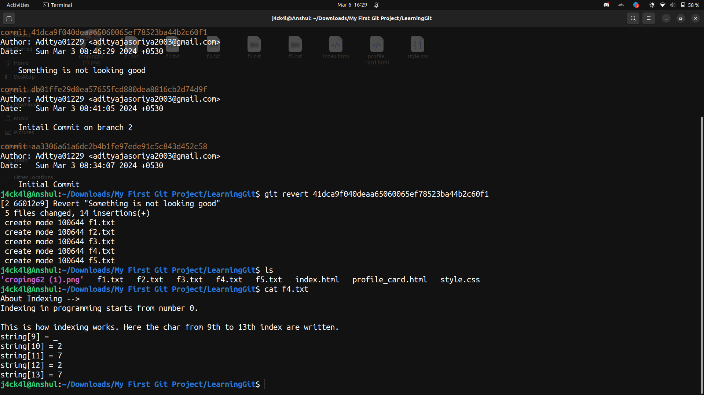

# VishwaCTF 2023

## Forensics/Repo Riddle

## Challenge Overview

`Description`: We got a suspicious Linkedin post which got a description and also a zip file with it. It is suspected that a message is hidden in there. Can you find it?

LinkedIn Post Description:

Title: My First Project -The Journey Begins

Hello fellow developers and curious minds!

I'm thrilled to share with you my very first Git project - a labor of love, dedication, and countless late-night commits. 🚀

Explore the code, unearth its nuances, and let me know your thoughts. Your feedback is invaluable and will contribute to the ongoing evolution of this project.

So we have been given a zip file My `First Git Project.zip`

So when we check the logs we see 3 commits in the master branch and we have 3 branches 

When we move back to the commit with message `second last commit`

So we see there is a new image file

Hence we get three characters of flag.

`string[6:9] = ger`

Now when we check HEAD of logs then we see another part of the flag

`string[0:3] = G1t`

When we move back to the first comomit we see 5 files.
`f[i].txt for i in range(1,5)`

when we read the file it says about what is the string array and how our flag will be formed.

When we move to the branch `2` we see another file index.html in which we have another part of the flag.

`string[3:6] = G1g`

Now for the final part of the flag we move back to the commit with message `Something is not looking good`

And when we see the files we see the remaining part of the flag

`string[9:14] = _2727`

So now when we add all the parts and wrap it in VishwaCTF{} we get 

**Flag** :  `VishwaCTF{G1tG1gger_2727}`