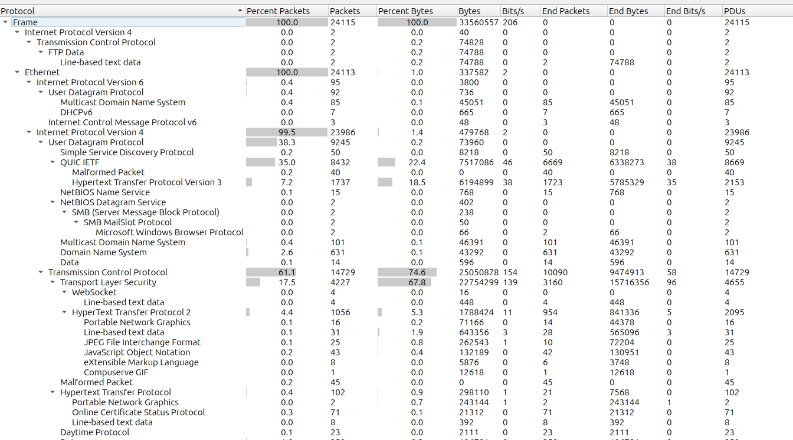
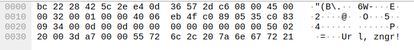
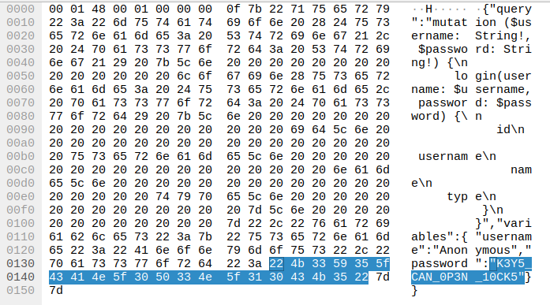

# Router |Port|

*There's some unusual traffic on the daytime port, but it isn't related to date or time requests. Analyze the packet capture to retrieve the flag*

Attachments: Capture.pcapng

Opening the capture file in wireshark and analysing the protocol hierarchy we see that there is `daytime protocol`



Looking at the daytime packets we see that there are **ROT-13** string in the load



```py
from scapy.all import *

pkts = rdpcap("./Capture.pcapng")
x = b""
for i in range(len(pkts)):
    try:
        if pkts[i]['TCP'].sport == 13:
            x+=pkts[i].load
    except:
        pass

print(x.decode())
```

Using Python and Scapy to carve the relevant data and decoding the ROT cipher using Cyberchef we get:
```
Hey, mate!Yo, long time no see!You sure this mode of communication is still safe?Yeah, unless someone else is capturing network packets on the same network we're using. Anyhow, our text is encrypted, and it would be difficult to interpret.So let's hope no one else is capturing.What's so confidential that you're about to share?It's about cracking the password of a person with the username 'Anonymous.'Oh wait! Don't you know I'm not so good at password cracking?Yeah, I know, but it's not about cracking. It's about the analysis of packets. I've completed most of the job, even figured out a way to get the session key to decrypt and decompress the packets.Holy cow! How in the world did you manage to get this key from his device?Firstly, I hacked the router of our institute and closely monitored the traffic, waiting for 'Anonymous' to download some software that requires admin privilege to install. Once he started the download, I, with complete control of the router, replaced the incoming packets with the ones I created containing malicious scripts, and thus gained a backdoor access to his device. The further job was a piece of cake.Whoa! It's so surprising to see how much you know about networking or hacking, to be specific.Yeah, I did a lot of research on that. Now, should we focus on the purpose of this meet?Yes, of course. So, what should I do for you?Have you started the packet capture as I told you earlier?Yes, I did.Great! I will be sending his SSL key, so find the password of 'Anonymous.'Yes, I would, but I need some details like where to start.The only details I have are he uses the same password for every website, and he just went on to register for a CTF event.Okay, I will search for it.Wait a second, I won't be sending the SSL key on this Daytime Protocol port; we need to keep this untraceable.I will be sending it through FTP. Since the file is too large, I will be sending it in two parts. Please remember to merge them before using it. Additionally, some changes may be made to it during transfer due to the method I'm using. Ensure that you handle these issues.Okay! ...
```

The message points to `FTP-DATA`, which contained the SSL keys we had to use to decrypt the data, But the text of the file was encoded using another ROT Cipher.

Loading the keys into wireshark and applying the filter `http2` we get the required password(flag)



Flag: `VishwaCTF{K3Y5_CAN_0P3N_10CK5}`