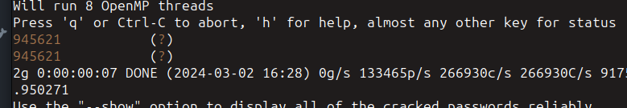

# Secret Code

*Akshay has a letter for you and need your help*

In the challenge we are provided with `confidential.jpg` and `letter.txt`.
Running binwalk on confidential.jpg we get a zip file `5ecr3t_c0de.zip` and a helper.txt.
Helper.txt states that the password to the new zip file is a 6 digit number.
Thus we make a wordlist that satisfies the given criteria and run `John The Ripper`.



The passcode - **945621**

We get `5ecr3t_c0de.txt` which has the pixel coordinates. Coloring these pixels white makes the flag completely visible.

```py
from PIL import Image
im = Image.open("confidential.jpg")
data = im.load()
width,height = im.size
f = open("./5ecr3t_c0de.txt","r")
lines = f.readlines()
for l in lines:
    x,y = l.strip()[1:-1].split(", ")
    x = int(x)
    y = int(y)
    data[x,y] = (255,255,255)
im.show()
im.save(fp="final.jpg")
```


