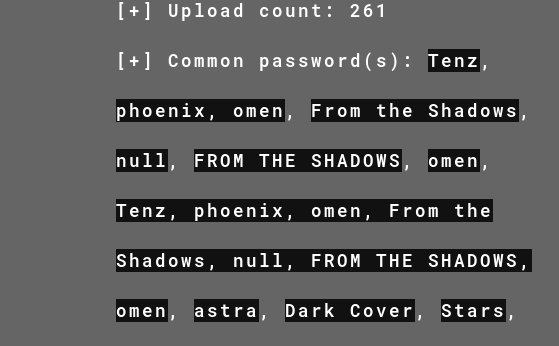

# We Are Valorant

*One day, while playing Valorant, I received a mail from Riot Games that read,

“In a world full of light, sometimes the shadows help you win.” “Your Signature move also helps you a lot ; develop one and ace it now.”

It also had an image and a video/gif attached to it. I am not able to understand what they want to say. Help me find what the message wants to express.*

In the challenge we are given `Astra.mp4` and `we_are_valorant.jpg`

Uploading the jpg on aperisolve, we get common passwords.



Trying the first password with steghide gives us `not_a_secret.txt` which says

```
Hello!!
hope you are enjoying the CTF
here's your flag


VishwaCTF{you_are_invited_to_the_biggest_valorant_event}
```