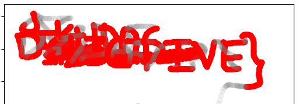
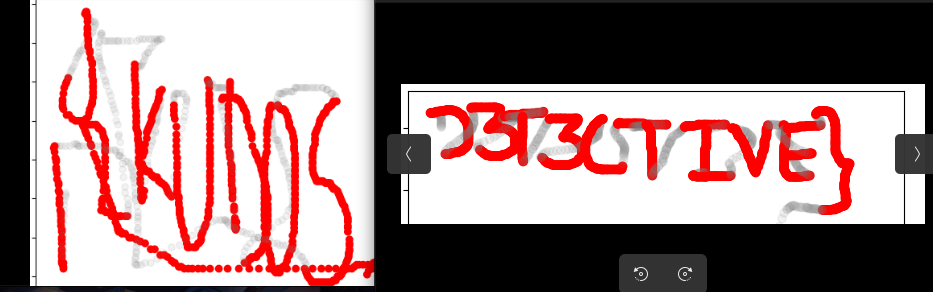

# Wired Secrets

*You are an intern at the Cyber Security Department of India and you have been assigned your first case. The Department has finally caught a notorious Hacker who communicates online in a Secretive manner. It is suspected that this file might contain clues to unlock critical information. Your task is to analyse the file and decipher any hidden messages or patterns to progress further in the investigation,*

*PS: Zero is Hero, and dont forget to treat brackets neatly.*

*Note : Flag has upper case letter and numbers only*

Attachments: okay10.pcapng

In the challenge we are given `USB` packets which contain the data of a mouse.

On observing we find that the packets of length `31` have the data for the mouse, so we use the filter `frame.len == 31`

I found a great tool for plotting the data of the
[mouse](https://github.com/WangYihang/USB-Mouse-Pcap-Visualizer "mouse")

After exporting the filtered packets to a new pcap file

`poetry run python usb-mouse-pcap-visualizer.py -i ./<name>.pcap`

There is some junk data, hence we filter the packets from number 11000 onwards but that is still not enough

Now we just take the packets from 12000-14500 and from 14500 onwards the next time

Flag: `VishwaCTF{KUD0SD3T3CTIVE}`

