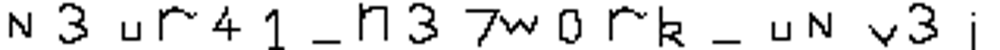
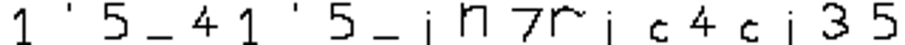
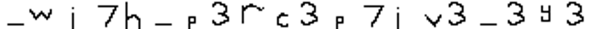

## How CNNs See 

We were given some images, a tensorflow model [NumberRecognizer.h5](assets/NumberRecognizer.h5), [Question.py](assets/Question.py) and some images in [Test_Images.zip](assets/Test_Images.zip). 

--- 

### Basic Walkthrough

Question.py does the basic loading and inference of the model 
```python
from tensorflow.keras.models import load_model

import matplotlib.pyplot as plt
import numpy as np
import tensorflow as tf
import cv2

model = load_model('NumberRecognizer.h5')

img = cv2.imread("Image Path")
image = [img]

image = np.expand_dims(image, axis=-1)
predictions= np.argmax(model.predict(image))
plt.imshow(np.squeeze(image), cmap='gray')
plt.title(f'Predicted Value : {predictions}')

plt.show()
```

And the images were also simple images from `MNIST` dataset, so we don't have much hint from where to begin.  

---

### Initial Recon

But since the title of the challenge syas `How CNNs work ?` I thought about exploring the weights of the model, becuase I had already solved a challenge which was along the similar lines. 

```txt
__________________________________________________________________________________________________
 Layer (type)                Output Shape                 Param #   Connected to                  
==================================================================================================
 input_37 (InputLayer)       [(None, 28, 28, 1)]          0         []                            
                                                                                                  
 resizing_32 (Resizing)      (None, 103, 103, 1)          0         ['input_37[0][0]']            
                                                                                                  
 conv2d_184 (Conv2D)         (None, 88, 88, 20)           5140      ['resizing_32[0][0]']         
                                                                                                  
 max_pooling2d_180 (MaxPool  (None, 88, 88, 20)           0         ['conv2d_184[0][0]']          
 ing2D)                                                                                           
                                                                                                  
 conv2d_185 (Conv2D)         (None, 73, 73, 1)            5121      ['max_pooling2d_180[0][0]']   
                                                                                                  
 max_pooling2d_181 (MaxPool  (None, 73, 73, 1)            0         ['conv2d_185[0][0]']          
 ing2D)                                                                                           
                                                                                                  
 conv2d_186 (Conv2D)         (None, 58, 58, 20)           5140      ['max_pooling2d_181[0][0]']   
                                                                                                  
 max_pooling2d_182 (MaxPool  (None, 58, 58, 20)           0         ['conv2d_186[0][0]']          
 ing2D)                                                                                           
                                                                                                  
 conv2d_187 (Conv2D)         (None, 43, 43, 1)            5121      ['max_pooling2d_182[0][0]']   
                                                                                                  
 max_pooling2d_183 (MaxPool  (None, 43, 43, 1)            0         ['conv2d_187[0][0]']          
 ing2D)                                                                                           
                                                                                                  
 conv2d_188 (Conv2D)         (None, 28, 28, 20)           5140      ['max_pooling2d_183[0][0]']   
                                                                                                  
 max_pooling2d_184 (MaxPool  (None, 28, 28, 20)           0         ['conv2d_188[0][0]']          
 ing2D)                                                                                           
                                                                                                  
 conv2d_189 (Conv2D)         (None, 28, 28, 1)            21        ['max_pooling2d_184[0][0]']   
                                                                                                  
 max_pooling2d_185 (MaxPool  (None, 28, 28, 1)            0         ['conv2d_189[0][0]']          
 ing2D)                                                                                           
                                                                                                  
 tf.math.multiply_8 (TFOpLa  (None, 28, 28, 1)            0         ['max_pooling2d_185[0][0]']   
 mbda)                                                                                            
                                                                                                  
 concatenate_20 (Concatenat  (None, 28, 28, 2)            0         ['tf.math.multiply_8[0][0]',  
 e)                                                                  'input_37[0][0]']            
                                                                                                  
 flatten_28 (Flatten)        (None, 1568)                 0         ['concatenate_20[0][0]']      
                                                                                                  
 dense_56 (Dense)            (None, 128)                  200832    ['flatten_28[0][0]']          
                                                                                                  
 dense_57 (Dense)            (None, 10)                   1290      ['dense_56[0][0]']            
                                                                                                  
==================================================================================================
Total params: 227805 (889.86 KB)
Trainable params: 202122 (789.54 KB)
Non-trainable params: 25683 (100.32 KB)
__________________________________________________________________________________________________
!ls Images

```

* The model seems to be a simple CNN model, so nothing much in it, now to get something out of it I had to dig deeper into the model. 

* So I started exploring the weights of the model. Shape of `model.weights[0]` was `TensorShape([16, 16, 1, 20])` which clearly wasn't matching with the summary, so I just printed it to check the weights and it turns out that all elements in it are ones with some zeros in between, and it cliked to me that this might be something related to flag. 

* Then I plotted `model.weights[0][:, :, 0, 0]` which should return a     16x16 image and it was a single charecter. 

---
### Solution

* From this point the goal was clear, I just had to plot the image of all such weights and complete the flag character by character. 

* At the time of solving I got the flag one by one, but just for fun I made a script which directly prints the flag :) 

```python
from tensorflow.keras.models import load_model
import matplotlib.pyplot as plt
import numpy as np
import tensorflow as tf
from PIL import Image

model = load_model('NumberRecognizer.h5')

flag_weights = [model.weights[0], model.weights[4], model.weights[8]]

combined = []
for image in flag_weights :
    combined.append(np.concatenate(np.transpose(image[:, :, 0, :], (2, 0, 1)), axis = 1))

fig, ax = plt.subplots(nrows = 3, ncols = 1, figsize = (30, 8))

for i, image in enumerate(combined) :
    ax[i].imshow(image, cmap = 'gray')
```

#### First part : 



#### Second part ;



#### Third part : 



---


Flag : `VishwaCTF{N3ur41_n37w0rk_uNv3i1'5_41'5_in7ric4ci35_wi7h_p3rc3p7iv3_3y3}`

Again first blood 🩸

