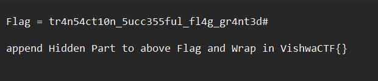

# Crack me

We recieve the .exe file. The first thing we do is open it in `IDA`. There are a hell lots of loops and LABELs that are used. We see that it first asks us for a username.

```c
//IDA decompiled code
strcpy((char *)v35, "^33&45!@_");
  v36 = 48;
  v37 = 0;
  while ( 2 )
  {
    system("cls");
    strcpy(v33, "3AWQM6QT0N38ry3S");
    while ( 1 )
    {
      printf("\nEnter Username: ");
      fflush((FILE *)__iob[0]._ptr);
      gets(Str1);
      printf("\nEnter Password: ");
      fflush((FILE *)__iob[0]._ptr);
      gets(&v33[17]);
      strcpy(v32, "3AWQM6QT0N38ry3S");
      if ( strcmp(Str1, "bank") )
        return 0;
      if ( !strcmp(&v33[17], "BANK101") )
        break;
      puts("wrong admin");
      printf("enter any key to return");
      getch();
}
    strcpy(&v31[22], "$^");
    printf("\n\nPassword Match!\nLOADING");
```

We see that it is then being compared with string `bank` . Also, we see the password that is demanded is `BANK101` . We enter it to pass this filter.

Now, we need to reverse the below code.

```c
v27 = 121;
    v25 = -1;
    while ( 1 )
    {
      while ( 1 )
      {
LABEL_9:
        while ( 1 )
        {
          printf("Hint : %s\n", v31);
          for ( i = 0; i <= 6; ++i )
          {
            fordelay(100000000);
            putchar(46);
          }
          system("cls");
          puts("\n\n");
          printf("-------------------------WELCOME TO BANK MANAGENENT SYSTEM----------------------");
          printf("\n\nWhat do you want to do?");
          printf("\n\n\t1. CREATE A NEW ACCOUNT");
          printf("\n\t2. LOGIN TO AN EXISTING ACCOUNT");
          printf("\n\nYour choice:\t");
          scanf("%d", &v25);
          if ( v25 != 1 )
            break;
          system("cls");
          printf("\nEnter your full name :\t");
          fflush((FILE *)__iob[0]._ptr);
          scanf("%s", Buffer);
          printf("\nEnter your account number:\t");
          fflush((FILE *)__iob[0]._ptr);
          scanf("%s", v15);
          printf("\nEnter your phone number:\t");
          fflush((FILE *)__iob[0]._ptr);
          scanf("%s", v14);
          printf("\nEnter your new password:\t");
          fflush((FILE *)__iob[0]._ptr);
          scanf("%s", v16);
          puts("\nEnter your Account Type:\t");
          printf("\n\t\tSaving");
          printf("\n\t\tFixed1");
          puts("\n\t\tFixed");
          puts("Enter the type -> ");
          fflush((FILE *)__iob[0]._ptr);
          scanf("%s", v17);
          printf("Enter Today's Date(day/month/year)");
          scanf("%d/%d/%d", &v19, &v20, &v21);
          v18 = 0.0;
          strcpy(Destination, v14);
          strcat(Destination, ".txt");
          *(_DWORD *)&v35[5] = fopen(Destination, "a");
          fwrite(Buffer, 0xD8u, 1u, *(FILE **)&v35[5]);
          printf("\n\nAccount succesfully registered");
          printf("\n\nenter any key to continue....");
          getch();
        }
        if ( v25 == 2 )
          break;
        printf("\tWrong Choice");
        printf("\n\tpress any key to return to home menu....");
        getch();
      }
      system("cls");
      printf("\nPhone number:\t");
      scanf("%s", Source);
      printf("Password:\t");
      scanf("%s", v11);
      strcpy(Destination, Source);
      strcat(Destination, ".txt");
      *(_DWORD *)&v35[5] = fopen(Destination, "r");
      if ( !*(_DWORD *)&v35[5] )
      {
        printf("\nAccount number not registered");
        return 0;
      }
      fread(Buffer, 0xD8u, 1u, *(FILE **)&v35[5]);
      fclose(*(FILE **)&v35[5]);
      if ( !strcmp(v11, v16) )
        break;
      printf("\nInvalid password");
      printf("\n press any key to return to home menu....");
      getch();
    }
    while ( v27 == 121 )
    {
      system("cls");
      printf("\n\tWelcome  to your account%s\n", v14);
      printf("\n---------------MAIN MENU--------------");
      printf("\n\nPress 1 for Account Details");
      printf("\nPress 2 for depositing cash");
      printf("\nPress 3 for cash withdrawl");
      printf("\nPress 4 for online transfer");
      printf("\nPress 5 for Account Edit");
      printf("\npress 6 for Exit");
      printf("\nThere is Hidden VAULT");
      printf("\n\nYour choice:\t");
      scanf("%d", v29);
      if ( v29[0] == 4 )
      {
        printf("Important link ( There is error ):  ");
        if ( error == 1 )
        {
          strcat(hsi, ssets);
          strcat(hsi, v33);
          strcat(hsi, lke);
        }
        printf("\n%s", hsi);
        printf("\nPlease enter the phone number to transfer the balance:\t");
        scanf("%s", Source);
        printf("\nPlease enter the amount to transfer:\t");
        scanf("%f", &v26);
        strcpy(Destination, Source);
        strcat(Destination, ".txt");
        *(_DWORD *)&v35[5] = fopen(Destination, "r");
        if ( *(_DWORD *)&v35[5] )
        {
          fread(v22, 0xD8u, 1u, *(FILE **)&v35[5]);
          fclose(*(FILE **)&v35[5]);
          if ( v26 <= (long double)v18 )
          {
            *(_DWORD *)&v35[5] = fopen(Destination, "w");
            v23 = v23 + v26;
            fwrite(v22, 0xD8u, 1u, *(FILE **)&v35[5]);
            fclose(*(FILE **)&v35[5]);
            printf("\nYou have succesfully transfered Rs.%.2f to %s", v26, Source);
            strcpy(Destination, v14);
            strcat(Destination, ".txt");
            *(_DWORD *)&v35[5] = fopen(Destination, "w");
            v18 = v18 - v26;
            fwrite(Buffer, 0xD8u, 1u, *(FILE **)&v35[5]);
            fclose(*(FILE **)&v35[5]);
          }
          else
          {
            printf("\nInsufficient balance");
          }
        }
        else
        {
          printf("\nAccount number not registered");
        }
      }
      else
      {
        if ( v29[0] > 4 )
        {
          if ( v29[0] == 6 )
            goto LABEL_9;
          if ( v29[0] < 6 )
          {
            printf("\nwhat you want to edit\t");
            printf("\n\nPress 1 for Password");
            printf("\nPress 2 for name");
            printf("\nyour choice: ");
            scanf("%d", &v28);
            if ( v28 == 1 )
            {
              printf("\nPlease enter your new password:\t");
              scanf("%s", v11);
              *(_DWORD *)&v35[5] = fopen(Destination, "w");
              strcpy(v16, v11);
              fwrite(Buffer, 0xD8u, 1u, *(FILE **)&v35[5]);
              printf("\nPassword succesfully changed");
            }
            else if ( v28 == 2 )
            {
              printf("\nPlease enter your New Name:\t");
              scanf("%s", v12);
              *(_DWORD *)&v35[5] = fopen(Destination, "w");
              strcpy(Buffer, v12);
              fwrite(Buffer, 0xD8u, 1u, *(FILE **)&v35[5]);
              printf("\nName succesfully changed");
            }
            goto LABEL_9;
          }
          if ( v29[0] == 420 )
          {
            vault(v36);
            goto LABEL_64;
          }
LABEL_63:
          printf("\nInvalid option");
          goto LABEL_64;
        }
        if ( v29[0] == 2 )
        {
          printf("\nEnter the amount:\t");
          scanf("%f", &v26);
          v18 = v18 + v26;
          *(_DWORD *)&v35[5] = fopen(Destination, "w");
          fwrite(Buffer, 0xD8u, 1u, *(FILE **)&v35[5]);
          printf("\nSuccesfully deposited.");
          fclose(*(FILE **)&v35[5]);
          goto LABEL_64;
        }
        if ( v29[0] > 2 )
        {
          printf("\nEnter the amount:\t");
          scanf("%f", &v26);
          v18 = v18 - v26;
          *(_DWORD *)&v35[5] = fopen(Destination, "w");
          fwrite(Buffer, 0xD8u, 1u, *(FILE **)&v35[5]);
          printf("\nYou have withdrawn Rs.%.2f", v26);
          fclose(*(FILE **)&v35[5]);
          goto LABEL_64;
        }
        if ( v29[0] != 1 )
          goto LABEL_63;
        printf("\n NAME: %s", Buffer);
        printf("\n PHONE NO: %s", v14);
        printf("\n ACCOUNT NO: %s", v15);
        printf("\n ACCOUNT Type: %s", v17);
        if ( temp24 == 1 && temp23 == 1 )
        {
          strcpy(v24, "0$get$");
          ans[10] = 65;
          strcat(ans, &pre_level);
          strcat(ans, (const char *)v35);
          strcat(ans, v24);
          *(_WORD *)&ans[strlen(ans)] = 125;
          temp23 = -1;
          temp24 = -1;
          printf("\n\n Flag : ");
          printf("%s", temp);
        }
        else if ( temp24 || v37 )
        {
          printf("\n\n Flag : %s", ans);
        }
        else
        {
          *(_WORD *)&ans[strlen(ans)] = 125;
          printf("\n\n Flag : %s", ans);
          v37 = -1;
          temp24 = 99999999;
        }
        if ( temp23 == -1 && temp24 == -1 )
          puts("\n You Are On way");
        printf("\n %s%s%s\n%s%s", "Not ", "me :", "( ", "But I'm", " Important");
        printf("\n\n Your current balance is Rs.%.2f", v18);
        printf("\nAccount Register on %d/%d/%d", v19, v20, v21);
        if ( !strcmpi(v17, "saving") )
        {
          *(float *)time = 0.083333336;
          rate = 8;
          interest(0.083333336, v18, 8);
          intrst = (int)(float)0.083333336;
          HIDWORD(v4) = v19;
          LODWORD(v4) = (int)(float)0.083333336;
          printf("\n You will get $.%.2f as interest on %d of every month", v4, v7);
        }
        if ( strcmpi(v17, "fixed1") )
        {
          if ( !strcmpi(v17, "fixed2") )
          {
            *(float *)time = 2.0;
            rate = 11;
            interest(2.0, v18, 11);
            intrst = (int)(float)2.0;
            HIDWORD(v6) = v19;
            LODWORD(v6) = (int)(float)2.0;
            printf("\n You will get $.%.2f as interest on %d/%d/%d", v6, v20, v21 + 1, v8);
          }
        }
        else
        {
          *(float *)time = 1.0;
          rate = 9;
          interest(1.0, v18, 9);
          intrst = (int)(float)1.0;
          HIDWORD(v5) = v19;
          LODWORD(v5) = (int)(float)1.0;
          printf("\n You will get $%.2f as interest on %d/%d/%d", v5, v20, v21 + 1, v8);
        }
        if ( intrst > Hidden_p )
        {
          printf("\nHidden Part : ");
          printf("\n%s", &v31[22]);
        }
        putchar(10);
      }
LABEL_64:
      printf("\n Do you want to continue the transaction [y/n]\t");
      scanf("%s", &v27);
    }
    if ( v27 == 110 )
      continue;
    break;
  }
  strcpy(&v24[7], " Flag = UGIstuffff");
  return 0;
}
```

We first create an account with whatever details we like as it doesn’t matter.

We then notice this.

```c
*(_WORD *)&ans[strlen(ans)] = 125;
          printf("\n\n Flag : %s", ans);
          v37 = -1;
          temp24 = 99999999;
```

125 is ascii for `}` . Hence, we want to get here and also we go to `ans` in memory to see this!

Thus, we need to create our flag inside `ans` . We use xref to see where `ans` is getting used.

It is firstly getting used in vault function.

Then we have to give a choice. To get the supposed flag, we want to access the `vault` function. For this, we enter 420 as choice to get to line 251 as per IDA decomplied code. Also, notice that as per my code, `v36` is passed into it. To get its value, we use `xref` to see that it getting 48 value stored in it. 

It looks like this:

```c
int __cdecl vault(char a1)
{
  if ( !temp24 )
    temp24 = -99;
  if ( !temp24 )
  {
    pre_level = a1;
    strcat(ans, wer);
    strcat(ans, hash);
    temp23 = 1;
    temp24 = 1;
  }
  error = -101;
  strcpy(lke, "m9c3Ck1fI21W9Cp4qBsFw");
  return printf("\n Your are on way (remember privilege level & you have to fill #)\n Directly check flag");
}
```

Now, we want to get inside the second if statement as `ans` has the flag forming inside it. But it is impossible to get in by simple techniques. Hence, we will break at the second comparison and patch the binary,i.e., go to memory address of `temp24` and set it to 0 just before second `if`. We then get our clue that we are on way. Notice the following changes: 

- `pre_level` now has value `'0'` as a1 was `'0'`
- `ans` is now `"VishwaCFT{"+?+"ccess_level_$6%3"`
- `temp24=temp23=1`
- `error=-101`
- `lke="m9c3Ck1fI21W9Cp4qBsFw"`

Now, ans is getting changed in main. After a bit of reading of code, we find that we need to give choice as 1 to get to that part. After doing so, we get here:

```c
if ( temp24 == 1 && temp23 == 1 )
        {
          strcpy(v24, "0$get$");
          ans[10] = 65;
          strcat(ans, &pre_level);
          strcat(ans, (const char *)v35);
          strcat(ans, v24);
          *(_WORD *)&ans[strlen(ans)] = 125;
          temp23 = -1;
          temp24 = -1;
          printf("\n\n Flag : ");
          printf("%s", temp);
        }
        else if ( temp24 || v37 )
        {
          printf("\n\n Flag : %s", ans);
        }
        else
        {
          *(_WORD *)&ans[strlen(ans)] = 125;
          printf("\n\n Flag : %s", ans);
          v37 = -1;
          temp24 = 99999999;
        }
        if ( temp23 == -1 && temp24 == -1 )
          puts("\n You Are On way");
        printf("\n %s%s%s\n%s%s", "Not ", "me :", "( ", "But I'm", " Important");
        printf("\n\n Your current balance is Rs.%.2f", v18);
        printf("\nAccount Register on %d/%d/%d", v19, v20, v21);
```

In the first run, we don’t get anything other than the message “You are on way”. However, we have changed a lot of things. The ans now is `VishwaCFT{Acess_level_$6%30^33&45!@_0$get$` . After this, we again choose 1 and break before `else if` line. We again set `temp24` to 0 and land inside the else part. The flag gets printed!
`VishwaCFT{Acess_level_$6%30^33&45!@_0$get$}` 

We are done! But no! It is not the real flag. Hence, we again look at the code to see what’s missing.

After a few minutes of searching, we find that in choice 4 some sort of link is getting printed.

 

```c
 if ( v29[0] == 4 )
      {
        printf("Important link ( There is error ):  ");
        if ( error == 1 )
        {
          strcat(hsi, ssets);
          strcat(hsi, v33);
          strcat(hsi, lke);
        }
```

Now, doing xrefs on error tells us that there’s no way to change its value to 1 other than patching. Hence, we do so. After that, the following link gets printed.

[`https://mega.nz/file/RukkkDJL#XQQwHD3AWQM6QT0N38ry3Sm9c3Ck1fI21W9Cp4qBsFw`](https://mega.nz/file/RukkkDJL#XQQwHD3AWQM6QT0N38ry3Sm9c3Ck1fI21W9Cp4qBsFw)
We go to the link and download `flag.exe` .It is password protected. We try to enter the only string that we have but it doesn’t work. After hours of trying, we find that the password was `Access_level_$6%30^33&45!@_0$get$` . we enter it to get `flag.png` .



We finally have the flag(atleast a part of it). Now, our quest begins to find the hidden part. Interestingly, we find it in choice 1 again. Although, we weren’t able to print it, we could see it in memory. It was `$^` .

```c
if ( intrst > Hidden_p )
        {
          printf("\nHidden Part : ");
          printf("\n%s", &v31[22]);
        }
        putchar(10);
```

We also remember this message: `\n Your are on way (remember privilege level & you have to fill #)\n Directly check flag` 

Hence, we remove the # from flag and add `0$^` to it to get `VishwaCTF{tr4n54ct10n_5ucc355ful_fl4g_gr4nt3d0$^}` .

However, we still weren’t able to submit it to the website. But the author confirmed that it was correct.
