# VishwaCTF 2023

## Web/Boot Failed

## Challenge Overview

`Description`: Boot Failed, Fix The System!!

We have been given a page in which some kernel logs are mentioned which says that it needs 8 gb of memory to boot but it only has 4096 (4gb)


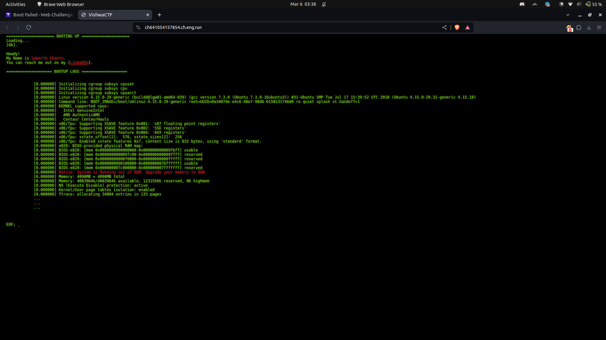

So we tried different things but the `/robots.txt` route is interesting.

When we open the page and open its corresponding js file i.e. `/javascripts/robots.js`

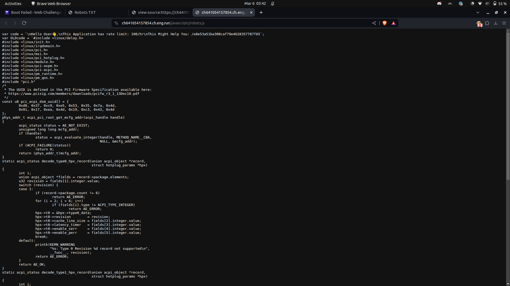

It has a special route i.e `/e8e53a51ba308caf79e4628357787f65`

When we go on this route we see a login page.

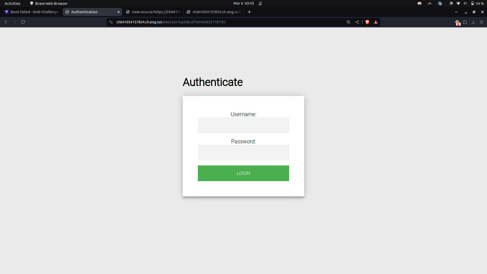

So when we see the js file of this page we see the creds on the top of the page i.e `system0:5yc0re`.

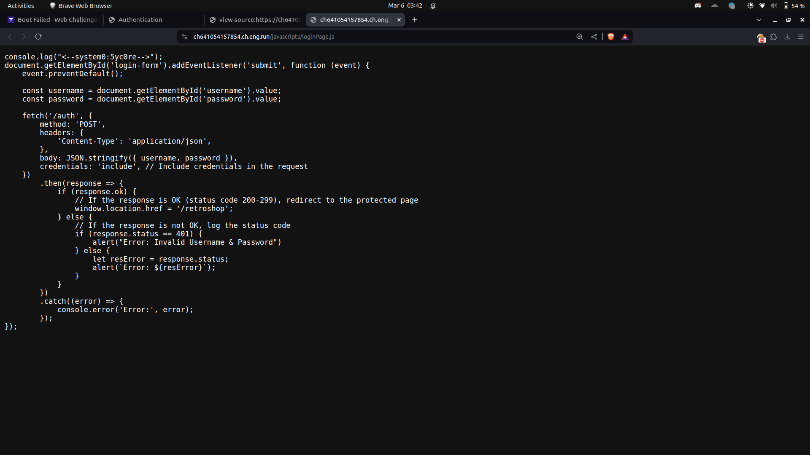


When we login on the page we see that we are only allowed to see the special page when we are `samarth` 

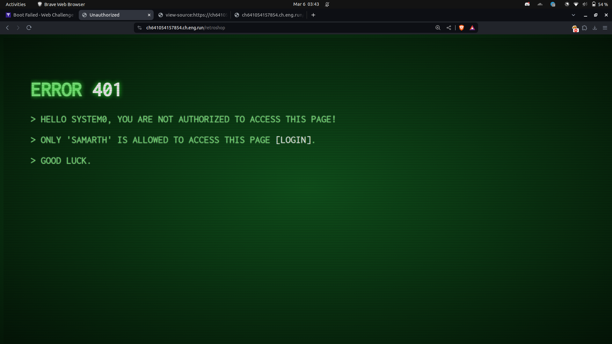

So when we see the request of login we see a jwt token being generated so our first thought is jwt weak key attack 

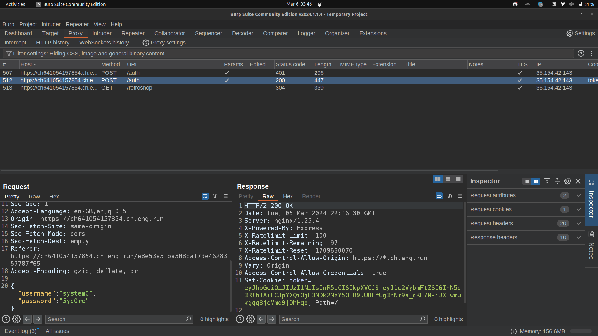

Tried `jwt_tool` on this page and we get the key in a second

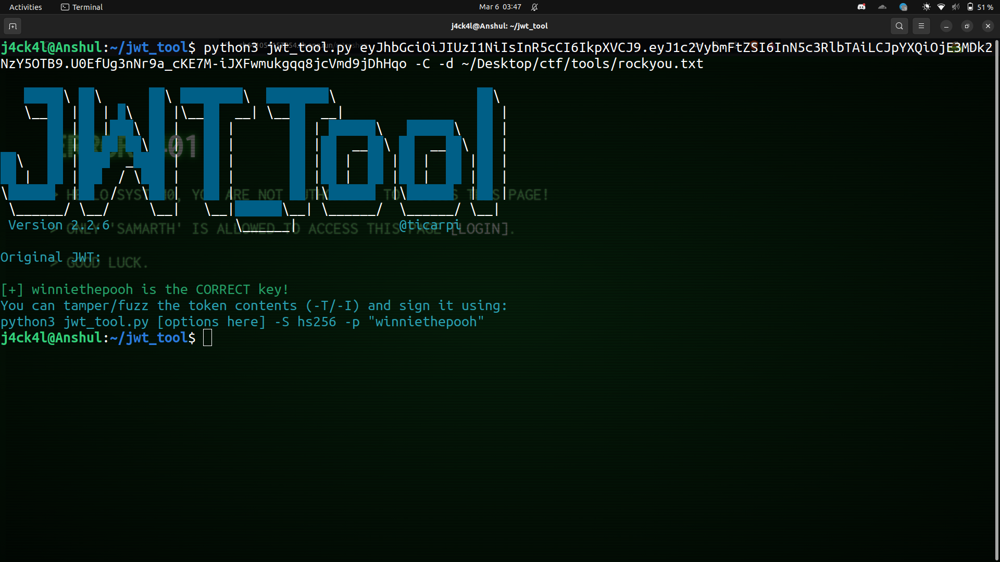

The key is `winniethepooh`

So we form the new token with `username:samarth` and then updated the cookie.

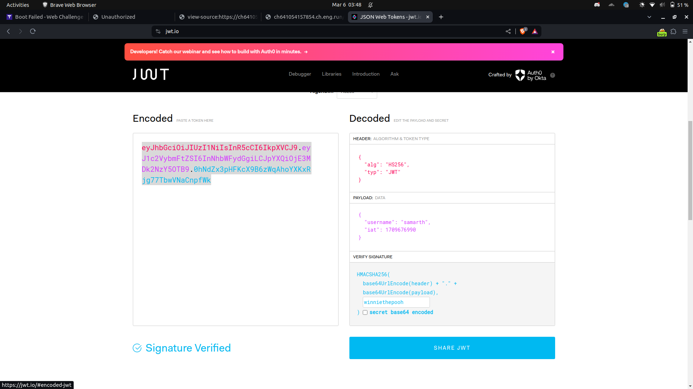

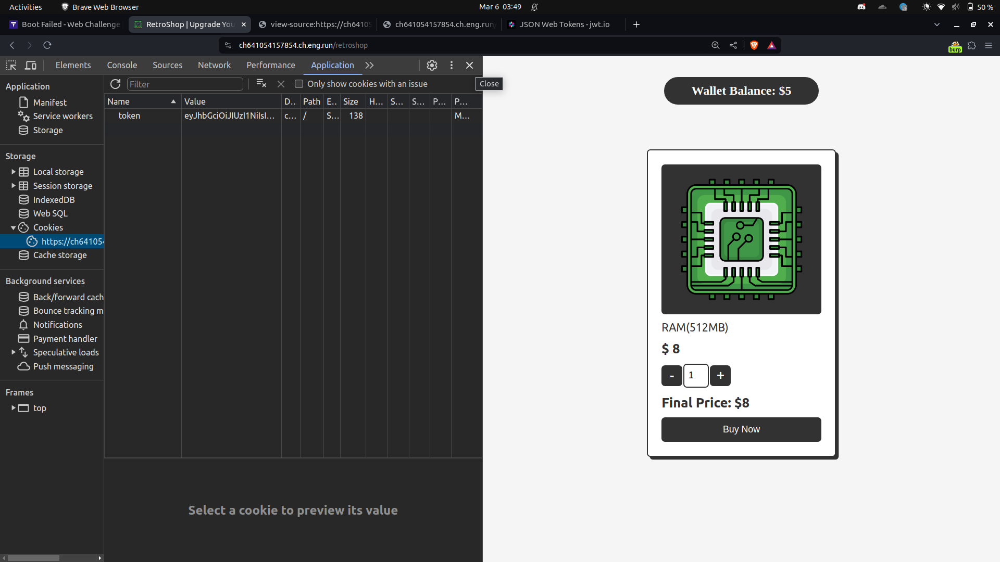

Now we see a shop page on which we can buy RAM. As mentioned on the first page we need `8 gb RAM` to load and we have 4 gb available so we have to buy `4 gb RAM` i.e `8*512 MB RAM`

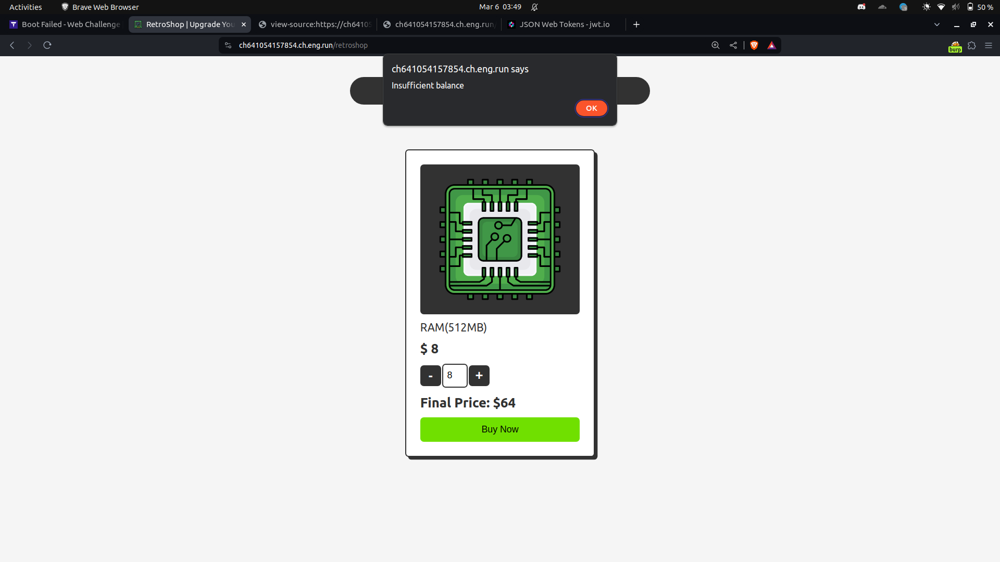

But the problem is we don't have sufficient balance so we tried seeing the request and the js file of this page to understand the logic.

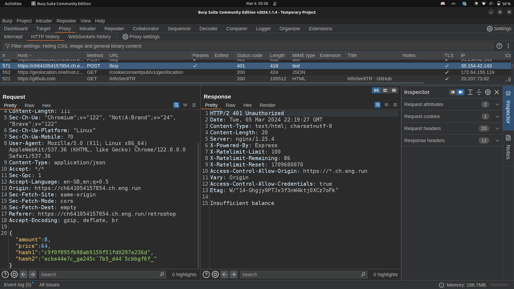

we see the amount field which is the quantity of the RAM needed and the price is the total cost of 8 RAM.

hash1 is the md5 of amount and hash2 is generated by some js logic.

```js
function _0x5933() {
    var _0x5cb948 = ['finalPrice', 'charCodeAt', '58323mjDghs', '18WIwleG', '714eYeaDT', '1942896RCOXXK', 'onload', 'replace', 'Final\x20Price:\x20$', 'itemCounter', 'text', '780DIlccu', '/buy', 'then', 'value', 'MD5', 'itemPrice', 'innerText', '45463sFtTDg', '5Chyxni', '637836IgAaEP', '12112sPcVLC', 'toString', 'getElementById', 'Server\x20error', '72ePkUML', '31924PZMEmO', 'stringify', '4821219ciiGrD'];
    _0x5933 = function() {
        return _0x5cb948;
    };
    return _0x5933();
}
var _0x5dd9b0 = _0x2bab;
(function(_0x4688c1, _0x5d3011) {
    var _0x4291a5 = _0x2bab,
        _0x5877ac = _0x4688c1();
    while (!![]) {
        try {
            var _0xa656a9 = -parseInt(_0x4291a5(0x157)) / 0x1 * (-parseInt(_0x4291a5(0x15d)) / 0x2) + parseInt(_0x4291a5(0x15c)) / 0x3 * (parseInt(_0x4291a5(0x156)) / 0x4) + -parseInt(_0x4291a5(0x16d)) / 0x5 * (parseInt(_0x4291a5(0x15f)) / 0x6) + parseInt(_0x4291a5(0x15e)) / 0x7 * (-parseInt(_0x4291a5(0x152)) / 0x8) + parseInt(_0x4291a5(0x159)) / 0x9 + -parseInt(_0x4291a5(0x165)) / 0xa * (parseInt(_0x4291a5(0x16c)) / 0xb) + -parseInt(_0x4291a5(0x16e)) / 0xc;
            if (_0xa656a9 === _0x5d3011) break;
            else _0x5877ac['push'](_0x5877ac['shift']());
        } catch (_0x40d319) {
            _0x5877ac['push'](_0x5877ac['shift']());
        }
    }
}(_0x5933, 0x4dec6), window[_0x5dd9b0(0x160)] = function() {
    updatePrice();
});

function updatePrice() {
    var _0x3b44e8 = _0x5dd9b0,
        _0x46c751 = parseFloat(document[_0x3b44e8(0x154)](_0x3b44e8(0x16a))[_0x3b44e8(0x16b)]),
        _0x449352 = document[_0x3b44e8(0x154)](_0x3b44e8(0x163))[_0x3b44e8(0x168)],
        _0x128027 = _0x46c751 * _0x449352;
    document[_0x3b44e8(0x154)](_0x3b44e8(0x15a))[_0x3b44e8(0x16b)] = 'Final\x20Price:\x20$' + _0x128027;
}

function increment() {
    var _0x696d33 = _0x5dd9b0,
        _0x5c3a1b = document[_0x696d33(0x154)](_0x696d33(0x163));
    _0x5c3a1b[_0x696d33(0x168)] = parseInt(_0x5c3a1b[_0x696d33(0x168)]) + 0x1, updatePrice();
}

function decrement() {
    var _0x396221 = _0x5dd9b0,
        _0x2b0bc2 = document[_0x396221(0x154)]('itemCounter');
    _0x2b0bc2[_0x396221(0x168)] > 0x1 && (_0x2b0bc2['value'] = parseInt(_0x2b0bc2[_0x396221(0x168)]) - 0x1, updatePrice());
}

function rotEnode(_0x3e9a95) {
    var _0x2bcc9b = _0x5dd9b0;
    return _0x3e9a95[_0x2bcc9b(0x161)](/[!-~]/g, function(_0x2d0c83) {
        var _0x33a703 = _0x2bcc9b;
        return String['fromCharCode']((_0x2d0c83[_0x33a703(0x15b)](0x0) + 0xe) % 0x5e + 0x21);
    });
}
const spell = '36cc6f4082acd41f3d05cc1d43387e70';

function _0x2bab(_0x1a7385, _0x2e0050) {
    var _0x59334c = _0x5933();
    return _0x2bab = function(_0x2bab14, _0x3345aa) {
        _0x2bab14 = _0x2bab14 - 0x152;
        var _0x64adbd = _0x59334c[_0x2bab14];
        return _0x64adbd;
    }, _0x2bab(_0x1a7385, _0x2e0050);
}

function buyNow() {
    var _0x2ff6b4 = _0x5dd9b0,
        _0x4b8702 = parseInt(document[_0x2ff6b4(0x154)](_0x2ff6b4(0x163))[_0x2ff6b4(0x168)]),
        _0x3a788f = parseFloat(document[_0x2ff6b4(0x154)](_0x2ff6b4(0x15a))[_0x2ff6b4(0x16b)][_0x2ff6b4(0x161)](_0x2ff6b4(0x162), '')),
        _0x566947 = CryptoJS[_0x2ff6b4(0x169)](_0x4b8702[_0x2ff6b4(0x153)]())[_0x2ff6b4(0x153)](),
        _0x35c26d = rotEnode((_0x3a788f + spell)['toString']()),
        _0x40ebe1 = {
            'amount': _0x4b8702,
            'price': _0x3a788f,
            'hash1': _0x566947,
            'hash2': _0x35c26d
        };
    fetch(_0x2ff6b4(0x166), {
        'method': 'POST',
        'headers': {
            'Content-Type': 'application/json'
        },
        'body': JSON[_0x2ff6b4(0x158)](_0x40ebe1)
    })[_0x2ff6b4(0x167)](_0x10876e => {
        var _0x42057f = _0x2ff6b4;
        return _0x10876e[_0x42057f(0x164)]()['then'](_0x35b762 => {
            _0x10876e['ok'] ? alert(_0x35b762) : alert(_0x35b762);
        });
    })['catch'](_0xdabaa8 => {
        var _0x45ed2c = _0x2ff6b4;
        alert(_0x45ed2c(0x155));
    });
}
```

If you see the `buyNow()` function we can see the logic of generating of hash2 

```js
_0x35c26d = rotEnode((_0x3a788f + spell)['toString']())
```

So we set the price to 2 and generate a hash corresponding to price = 2.

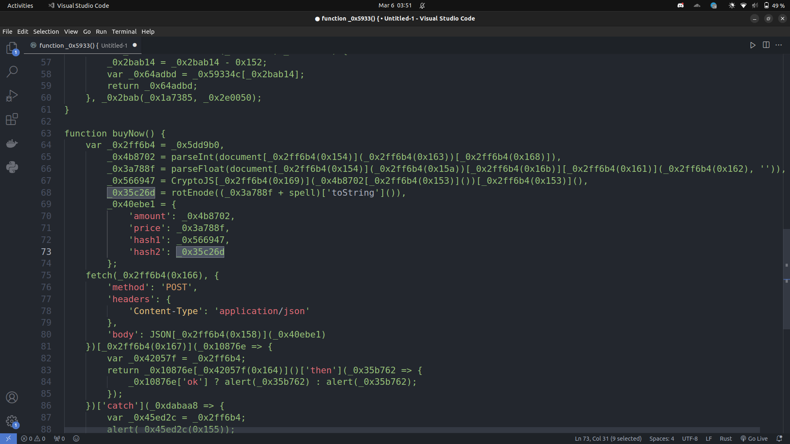

We added a line in the js code in our local system and opened it with index.html.

```js
console.log(rotEnode((2 + spell)['toString']()))
```

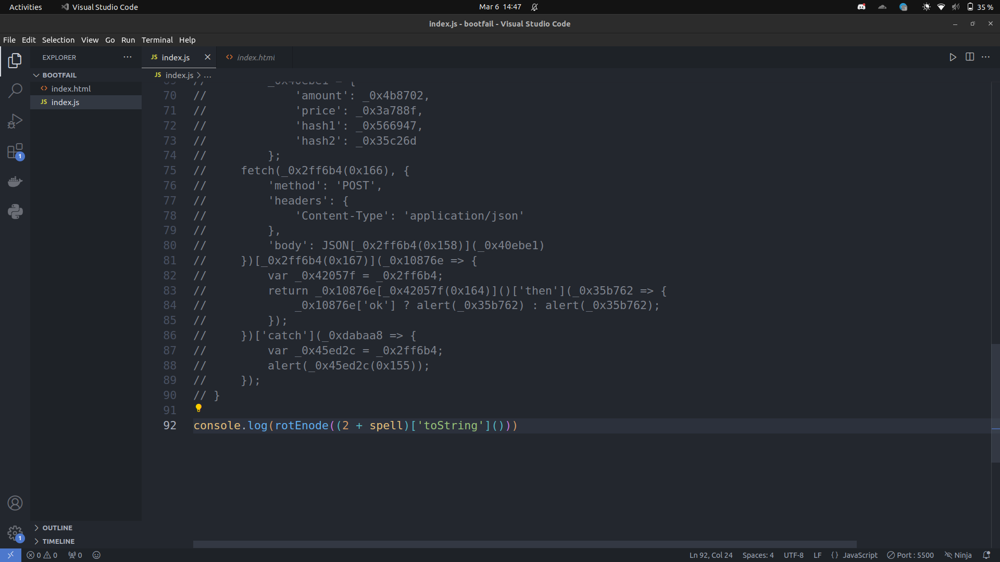

we get the generated hash2 in console.

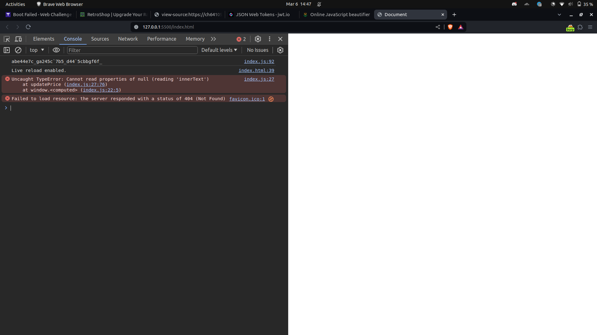

set the hash2 = ``abe44e7c_ga245c`7b5_d44`5cbbgf6f_``

Send the updated request and boom we get the flag.

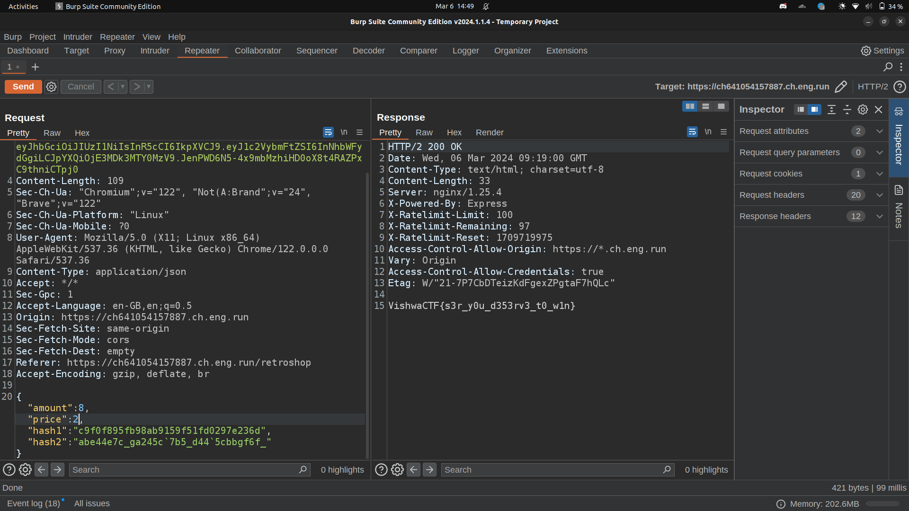

**Flag** :  `VishwaCTF{s3r_y0u_d353rv3_t0_w1n}`

Decent challenge.

Thank You

Happy Hacking :)