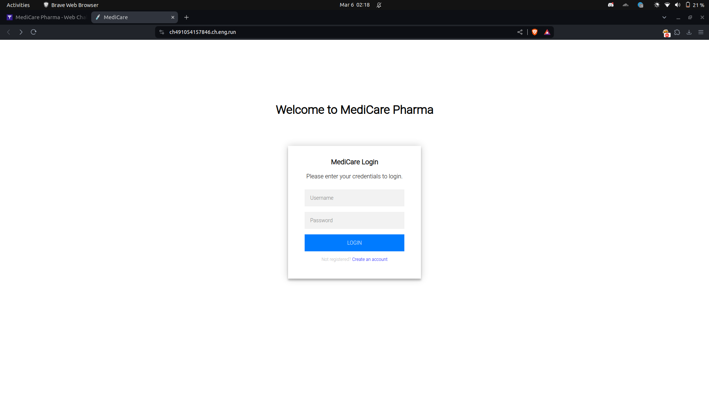
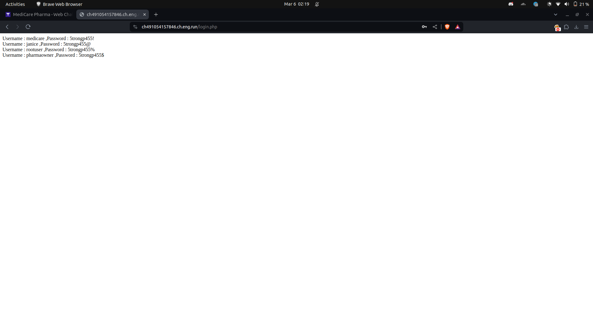
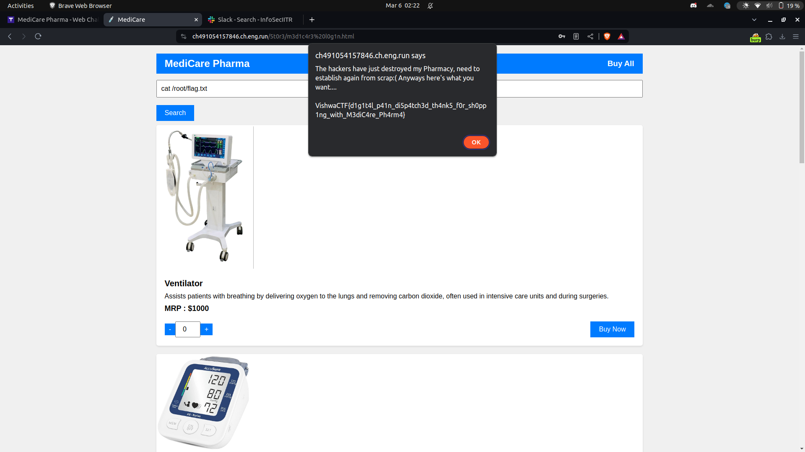

# VishwaCTF 2023

## Web/MediCare Pharma

## Challenge Overview

`Description`: Greetings form MediCare Pharma!!!!

We have started a very new pharmacy where we have various surgical equipments (more to be added soon).

But recently some hackers took control of our server and changed a hell lot of things (probably wiped out everything). Luckily we have few of the accounts and we need more consumers on board. For security reasons, we have disabled SignUp, only authorised persons are allowed to login.

Have a look at our pharmacy and hope we grow again soon.

We have been given a website which has a simple login page so our first thought is sqli.

We can bypass the password check by just putting
`username: asdfndj' *` and similarly password `password: ' *` which will dump all the users and their passwords

Now just login onto the website and we see a page with search parameter and when we put ls then the command gets executed so we have a rce here.

If you search for flag it is in the /root directort so put `cat /root/flag.txt` in the search parameter and we will get the flag

**Flag** :  `VishwaCTF{d1g1t4l_p41n_di5p4tch3d_th4nk5_f0r_sh0pp1ng_with_M3diC4re_Ph4rm4}`