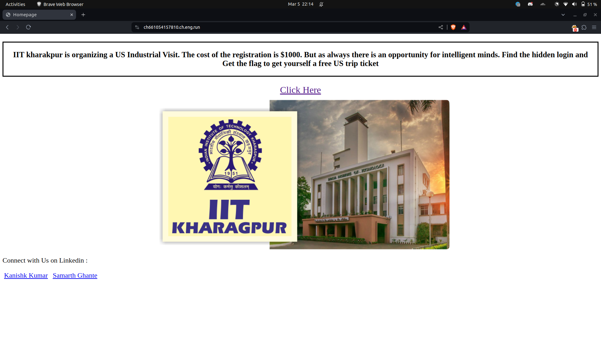
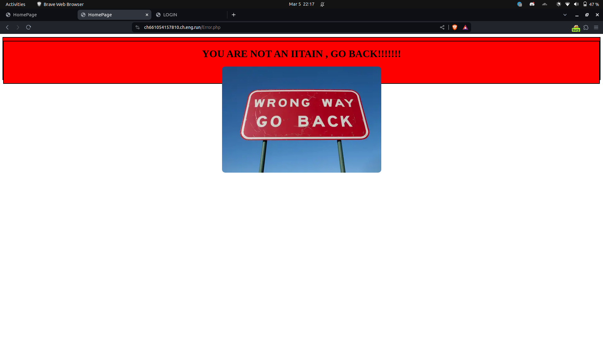
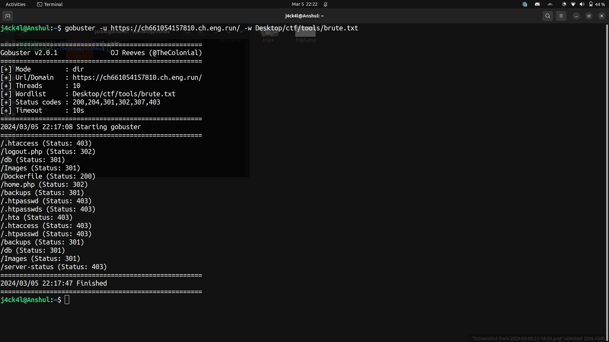
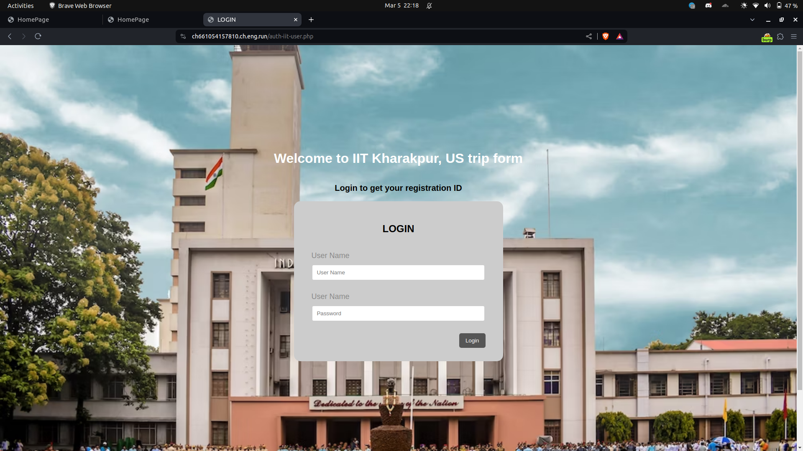
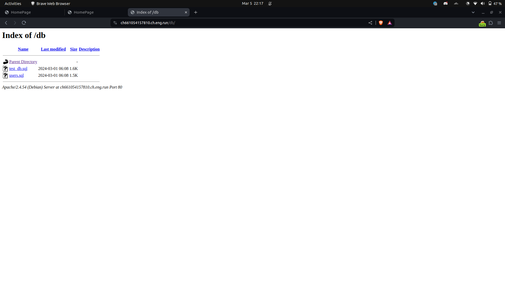
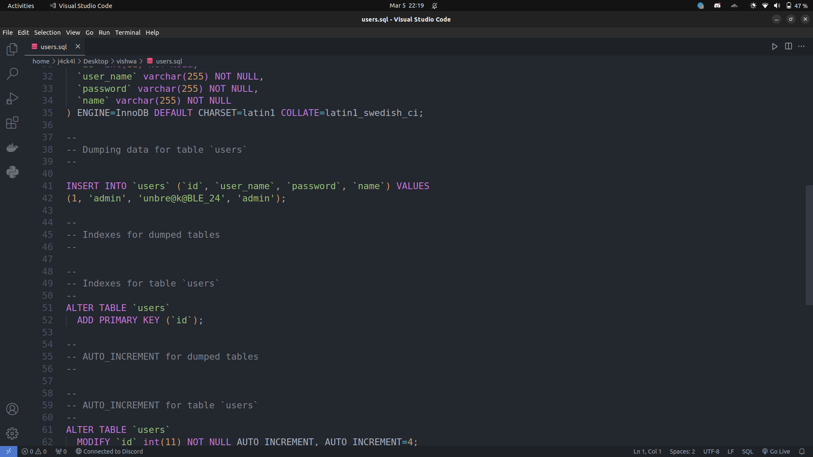
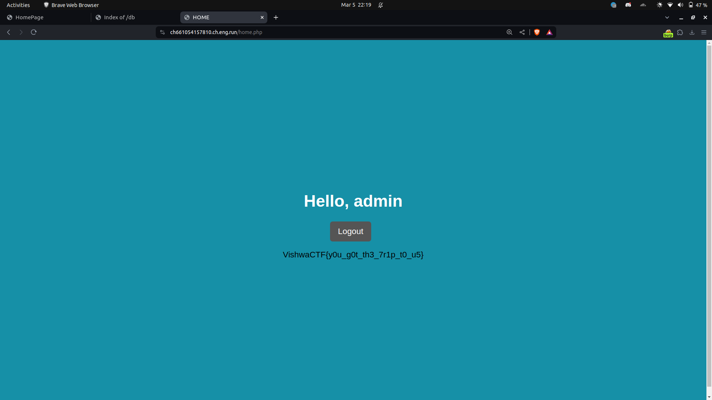

# VishwaCTF 2023

## Web/Trip To US

## Challenge Overview

`Description`: IIT kharakpur is organizing a US Industrial Visit. The cost of the registration is $1000. But as always there is an opportunity for intelligent minds. Find the hidden login and Get the flag to get yourself a free US trip ticket.

We have been given a website which has a simple button which redirects us to a page `/Error.php`

The page simply says You are not an IITIAN.
If you look at source code it says to set useragent to IITIAN but it doesn't make any changes

So I tried listing all the possible routes on this page as it says there is a hidden login page and here is the output

If we see the routes carefully there are routes for `Dockerfile` which reveals the Dockerfile (useless to solve the challenge).

There are 2 more suspicious routes i.e. `/db` and  `/home.php`

Here is our login page on `home.php`

Interesting route is this because we get the database schema of the secret login page.

We can clearly see the password of admin.

`admin:unbre@k@BLE_24`

When we login with these creds on `/home.php` we get the flag

**Flag** :  `VishwaCTF{y0u_g0t_th3_7r1p_t0_u5}`